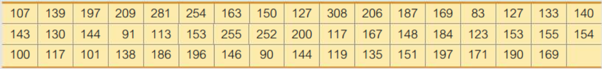

# Exploring Data with Tables and Graphs


**Learning Outcome:**

---
*Interpret quantitative data using tables and graphs, and descriptive statistics using histograms.* 
---

The chapter introduces various techniques such as frequency table and histogram to organize quantitative data to explore its important characteristics.


## Frequency Distribution


$\text {Table: Drive-Through Service Times (seconds) for McDonald's Lunches}$





A **frequency distribution (or frequency table)** shows how data are partitioned among several categories (or classes) by listing the categories along with the number (frequency) of data values in each of them.


$$  
\bbox[white,4px]
{
\color{black}
{
\begin{array}{c|c|c|c} 
\text{Time(Seconds)}  & \text{Frequency}  \\
\hline
\text{75-124} & \text{11}  \\
\text{125-174} & \text{24}  \\
\text{175-224} & \text{10}  \\
\text{225-274} & \text{3}  \\
\text{275-324} & \text{2}  \\
\hline
\text{Total} & 50
\end{array}
}
}
$$

Lower class limits: ${75, 125, 175, 225, 275}$  
Upper class limits: ${124, 174, 224, 274, 324}$  
Class boundaries: ${74.5, 124,5, 174.5, 224.5, 274.5, 324.5}$  
Class midpoints: ${99.5, 149.5, 199.5, 249.5, 299.5}$  
Class width: $124.5 - 74.5 = 50$  


#### Relative Frequency Distribution {-}

A **relative frequency distribution (or percentage frequency distribution)** is a variation of the basic frequency distribution in which a class frequency is replaced by a relative frequency (or proportion). 


$$
\begin{align}
\text{relative frequency for a class} &= \dfrac{\text{frequency for a class}}{\text{sum of all frequencies}} \\
\text{percentage of a class} &= \dfrac{\text{frequency for a class}}{\text{sum of all frequencies}} \times 100\%\\
\end{align}
$$


$$
\bbox[white,4px]
{
\color{black}
{
\begin{array}{c|c} 
\text{Time(Seconds)}  & \text{Relative  Frequency}  \\
\hline
\text{75-124}  & \text{22}\%  \\
\text{125-174} & \text{48}\%  \\
\text{175-224} & \text{20}\%  \\
\text{225-274} & \text{6}\%   \\
\text{275-324} & \text{4}\%   \\
\hline
               & 100\% 
\end{array}
}
}
$$


#### Cumulative Distribution {-}


$$
\bbox[white,4px]
{
\color{black}
{
\begin{array}{c|c|c} 
\text{Time(Seconds)}  & \text{N}  & \text{%}  \\
\hline
\text{75-124}  & 11 & \text{22}\%  \\
\text{125-174} & 35 & \text{70}\%  \\
\text{175-224} & 45 & \text{90}\%  \\
\text{225-274} & 48 & \text{96}\%   \\
\text{275-324} & 50 & \text{100}\%   \\
\hline
\end{array}
}
}
$$


## Histogram 

A histogram is a graph consisting of bars of equal width drawn adjacent to each other. The horizontal scale represents classes of quantitative data values; and the vertical scale represents frequencies.

A **relative frequency histogram** has the same shape and horizontal scale as a histogram, but the vertical scale uses relative frequencies (as percentages) instead of actual frequencies.


```{r include=FALSE}
library(dplyr)
library(ggplot2)
library(tidyverse)
library(showtext)
library(patchwork)
library(plotly)

font_add_google("Lobster Two", "lobstertwo")
font_add_google("Roboto", "roboto")
font_add_google("Poppins", "poppins")
showtext_auto()


theme_set(theme_bw())
theme_update(
  legend.text = element_text(size=30, family = "roboto"),
  legend.title = element_text(face="bold", size=30, family = "roboto"),
  legend.position = c(1,0),
  legend.justification = c(1, 0),
  text = element_text(family = "Poppins", size = 30, color = "black"),
  plot.title = element_text(family = "Poppins", size = 30,
                            face = "bold", color="#2a475e"),
  plot.subtitle = element_text(family = "Poppins", size = 24, 
                               face = "bold", color="#1b2838"),
  plot.caption = element_text(size = 24),
  plot.title.position = "plot",
  #plot.caption.position = "plot",
  axis.text = element_text(size = 24, color = "black"),
  axis.title = element_text(size =24),
  axis.ticks = element_blank(),
  axis.line = element_line(colour = "grey50"),
  rect = element_blank(),
  panel.grid = element_line(color = "#b4aea9"),
  panel.grid.minor = element_blank(),
  panel.grid.major.x = element_blank(),
  #panel.grid.major.x = element_line(linetype="dashed"),
  #panel.grid.major.y = element_blank(),
  panel.grid.major.y = element_line(linetype="dashed"),
  plot.background = element_rect(fill = '#fbf9f4', color = '#fbf9f4')
)


mcd <- c(107, 139, 197, 209, 281, 254, 163, 150, 127, 308, 206, 187, 169,  83, 127, 133, 140,
          143, 130, 144,  91, 113, 153, 255, 252, 200, 117, 167, 148, 184, 123, 153, 155, 154,
          100, 117, 101, 138, 186, 196, 146,  90, 144, 119, 135, 151, 197, 171, 190, 169)
mcd <- data.frame(mcd)
```

```{r echo=FALSE, message=FALSE, warning=FALSE}
p1 <- ggplot(data=mcd, aes(x=mcd)) + 
  geom_histogram(breaks=c(75, 125, 175, 225, 275, 325), 
                 col="red", 
                 fill="green", 
                 alpha = .2) + 
  labs(title = "Frequency", x="Times (sec)", y="Count") + 
  xlim(c(75,325))  
  # ylim(c(0,30))


p2 <- ggplot(data=mcd, aes(x=mcd)) + 
  geom_histogram(aes(y = stat(count) / sum(count)*100), 
                     breaks=c(75, 125, 175, 225, 275, 325), 
                 col="red", 
                 fill="green", 
                 alpha = .2) + 
  labs(title = "Relative Frequency", x="Times (sec)", y="Percent of Total") + 
  xlim(c(75,325))  


p1 + p2 +
  plot_layout(guides = "collect") +
  plot_annotation(title = "Histogram: Drive-Through Service Times (seconds)")
```

**Importance of Histogram**

* Visually displays the shape of the distribution of the data  
* Shows the location of the center of the data  
* Shows the spread of the data   
* Identifies outliers


#### Density Histogram {-}


$$
\begin{align}
\textbf{Density} &= \dfrac{\textbf{relative frequency}}{\textbf{bin width}} \\
\text {Density of class (75-124)}
&= \dfrac{\text{rel. freq of class (75-124)}}{\text{class width}} \\
&= \dfrac{0.22}{50}   \\                         
&= 0.0044
\end{align}
$$


```{r echo=FALSE, message=FALSE, warning=FALSE}
ggplot(data=mcd, aes(x=mcd, y=..density..)) + 
  geom_histogram(breaks=c(75, 125, 175, 225, 275, 325), 
                 col="red", 
                 fill="green", 
                 alpha = .2) + 
  labs(title = "Density Histogram", x="Times (sec)", y="Density") + 
  xlim(c(75,325))  
  # ylim(c(0,30))
```


In density histogram, area of each rectangular bar is the relative frequency of its class. 


**Practice - Construct a Density Histogram**

The accompanying frequency distribution summarizes data on the number of times smokers attempted to quit before their final successful attempts.

$$ \bbox[yellow,5px]
{
\color{black}
{
\begin{array}{r|c}
\text{Number of attempts} & \text{Frequency} \\
\hline
\textbf{0-10} & 778 \\
\textbf{10-20} & 306 \\
\textbf{20-30} & 274  \\
\textbf{30-40} & 221 \\
\textbf{40-50} & 238 
\end{array}
}
}
$$


## Other Charts

**Dotplot**

A dotplot uses dots to show the frequency, or number of occurrences, of the values in a data set. The higher the stack of dots, the greater the number of occurrences there are of the corresponding value.

```{r echo=FALSE, message=FALSE, warning=FALSE, comment=NA}
df <- c(70,
        80,
        75,
        75,
        50,
        70,
        65,
        65,
        70,
        85,
        75,
        80,
        70,
        65); df <- as.data.frame(df)
ggplot(df, aes(x = df)) + geom_dotplot(method="histodot") + labs(title = "Dotplot", x = "") +
    scale_y_continuous(NULL, breaks = NULL)
```


**Pie Charts**

The distribution of a categorical variable can be described by a **pie chart**, which is a disk where slices represent the categories. The proportion of the total area for one slice is equal to the relative frequency for the category represented by the slice. The relative frequencies are usually written as percentages.

Example 1: Construct and Interpret a Pie Chart

A total of 273 children were surveyed about what job they would want to do. The jobs and the percentages of the children who voted for them are shown in the table. 

$$ \bbox[yellow,5px]
{
\color{black}
{
\begin{array}{r|c}
\text{Job} & \text{Percent} \\
\hline
\text{Spy/Agent} & 16 \\
\text{Veterinarian} & 13 \\
\text{Professional Athlete} & 12  \\
\text{Movie Star} & 10 \\
\text{Video Game Designer} & 8 \\
\text{Doctor} & 6 \\
\text{Other} & 35 
\end{array}
}
}
$$


```{r echo=FALSE, message=F, warning=FALSE}
library(ggplot2)
library(dplyr)
df <- data.frame(
  group = c("Spy/Agent", "Veterinarian", "Prof. Athlete", "Movie Star", "Video Game Desiner", "Doctor", "Other"),
  value = c(16, 13, 12, 10, 8, 6, 35)
  )

df <- df %>%
  arrange(desc(group)) %>%
  mutate(lab.ypos = cumsum(value) - 0.5*value)

mycols <- c("#0073C2FF", "#EFC000FF", "#868686FF", "#CD534CFF", "darkgreen", "darkorange", "#56B4E9")

ggplot(df, aes(x = "", y = value, fill = group)) +
      geom_bar(width = 1, stat = "identity", color = "white") +
      coord_polar("y", start = 0)+
      geom_text(aes(y = lab.ypos, label = value), color = "white") +
      scale_fill_manual(values = mycols) +
      theme_void()
```

Questions:

1. Find the proportion of the observations that fall in the spy category.

2. Find the proportion of the observations that do NOT fall in the spy category.

3. Find the proportion of the observations that fall in the athlete category OR fall in the movie-star category.


**Interpreting a Multiple Bar Graph**

In a survey in 2012, 1960 adults were asked the following question: "Generally speaking, do you usually think of yourself as a Republican, Democrat, Independent, or other?" The results of the survey are described by the multiple bar graph. 


```{r echo=FALSE, message=F, warning=FALSE}
Party <- c("Democrats", "Independent", "Republican", "Other")
Women <- c(.37, .38, .23, .02)
Men <- c(.29, .43, .24, .03)

data <- data.frame(Party, Women, Men)

p <- data %>% 
  plot_ly() %>%
  add_trace(x = ~Party, y = ~Women, type = 'bar', 
             text = Women, textposition = 'auto',
             name = "Women",
             marker = list(color = 'rgb(158,202,225)',
                           line = list(color = 'rgb(8,48,107)', width = 1.5))) %>%
  add_trace(x = ~Party, y = ~Men, type = 'bar', 
            text = Men, textposition = 'auto',
            name = "Men",
            marker = list(color = 'rgb(58,200,225)',
                          line = list(color = 'rgb(8,48,107)', width = 1.5))) %>%
  layout(barmode = 'group',
         xaxis = list(title = "Party"),
         yaxis = list(title = "Relative Frequency")) 
p
```


1. What proportion of women thought of themselves as Democrats?

2. Which political party did the greatest proportion of men choose?

3. Compare the proportion of women who thought of themselves as Independents to the proportion of men who thought of themselves as Independents.

4. A total of 1081 women and 879 men responded to the survey. Were there more women or men who thought of themselves as Independents? How is this possible, given there was a smaller proportion of women who thought of themselves as Independents than men?


**Two-Way (Contingency) Table**

The table summarizes the responses from all 42 students who participated in the survey about whether they had read a novel in the past year.

$$ \bbox[yellow,5px]
{
\color{black}
{
\begin{array}{l|c|c|c}
\text{Gender} & \text{Did Not Read Novel} & \text{Read Novel} & \text{Total}  \\
\hline
\text{Female} & 6 & 19 & 25 \\
\text{Male} & 6 & 11 & 17 \\
\hline 
\text{Total} & 12 & 30 & 42 \\
\hline 
\end{array}
}
}
$$

1. How many of the students read a novel in the past year?
2. What proportion of the students did not read a novel in the past year?
3. What proportion of the women read a novel in the past year?
4. What proportion of the students is men AND read a novel in the past year?

