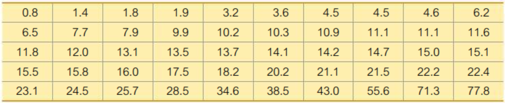
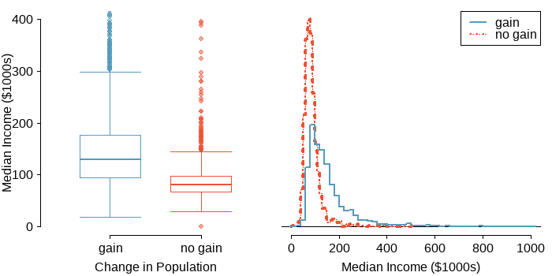

# Describing, Exploring, and Comparing Data


**Learning Outcome:**

---
Calculate measures of central tendency, position, and spread, including standard deviation. Interpret quantitative data using graphs and descriptive statistics with emphasis on histograms and boxplots.
---

In this chapter, we will numerically describe distributions of quantitative variables. Distributions, such as histograms, can be described by three characteristics:  shape, center, and spread.


```{r include=FALSE}
library(dplyr)
library(ggplot2)
library(tidyverse)
library(showtext)
library(patchwork)
library(plotly)

font_add_google("Lobster Two", "lobstertwo")
font_add_google("Roboto", "roboto")
font_add_google("Poppins", "poppins")
showtext_auto()


theme_set(theme_bw())
theme_update(
  legend.text = element_text(size=30, family = "roboto"),
  legend.title = element_text(face="bold", size=30, family = "roboto"),
  legend.position = c(1,0),
  legend.justification = c(1, 0),
  text = element_text(family = "Poppins", size = 30, color = "black"),
  plot.title = element_text(family = "Poppins", size = 30,
                            face = "bold", color="#2a475e"),
  plot.subtitle = element_text(family = "Poppins", size = 24, 
                               face = "bold", color="#1b2838"),
  plot.caption = element_text(size = 24),
  plot.title.position = "plot",
  #plot.caption.position = "plot",
  axis.text = element_text(size = 24, color = "black"),
  axis.title = element_text(size =24),
  axis.ticks = element_blank(),
  axis.line = element_line(colour = "grey50"),
  rect = element_blank(),
  panel.grid = element_line(color = "#b4aea9"),
  panel.grid.minor = element_blank(),
  panel.grid.major.x = element_blank(),
  #panel.grid.major.x = element_line(linetype="dashed"),
  #panel.grid.major.y = element_blank(),
  panel.grid.major.y = element_line(linetype="dashed"),
  plot.background = element_rect(fill = '#fbf9f4', color = '#fbf9f4')
)
```


## Measures of Shape

**Modes**

The **mode** of some data is an observation with the greatest frequency. There can be more than one mode, but if all the observations have frequency 1, then there is no mode.

**Mode is represented by a prominent peak in the distribution.**


**Unimodel Distribution**


```{r echo=FALSE, message=FALSE, warning=FALSE, comment=NA}
 set.seed(1234)                            # include seed for same samples
 n = 50000
 y1 = rnorm(n, 10, 1)
 hist(y1, probability = T, ylim=c(0,0.5), col="skyblue2", main="", xlab="", 
      cex.lab=3, cex.axis=3, cex.main=3, cex.sub=3)
 curve(dnorm(x,10,1), lwd=2, col="blue", add=T)
```


**Bimodal Distribution** 


```{r echo=FALSE, message=FALSE, warning=FALSE, comment=NA}
# https://math.stackexchange.com/questions/2149570/how-to-generate-sample-from-bimodal-distribution
set.seed(12345)                            # include seed for same samples
n = 20000;  u1 = rbeta(n, .5, .5)           # 2000 wasteful, but simple
cond = u1 > .01 & u1 < .99                   
v1 = u1[cond];  x1 = v1[1:10000]             # truncate and use 500
n = 20000; y1 = rnorm(n, 5, 2);  y2 = rnorm(n, 10, 1)  # same SD
w = rbinom(n, 1, .5)                     
x2 = w*y1 + (1-w)*y2                      
par(mfrow=c(1,2))                       
  hist(x1, prob=T, col="skyblue2", xlab="", main="", 
       cex.lab=3, cex.axis=3, cex.main=3, cex.sub=3)
    k = diff(pbeta(c(.01,.99),.5,.5))      # adj for truncation
    curve((1/k)*dbeta(x, .5, .5),.01,.99, lwd=2, col="blue", add=T)
  hist(x2, prob=T, col="skyblue2", ylim=c(0,.2), xlab="", main="", breaks = 25, 
       cex.lab=3, cex.axis=3, cex.main=3, cex.sub=3)
    curve(.5*dnorm(x,5,2)+.5*dnorm(x,10,1), lwd=2, col="blue", add=T)
par(mfrow=c(1,2))                        # return to default single panel
```


**Multimodal Distribution** 


```{r echo=FALSE, message=FALSE, warning=FALSE, comment=NA}
set.seed(123456)                            # include seed for same samples
n = 20000
y1 = rnorm(n, 0, 3);  y2 = rnorm(n, 10, 2);  y3 = rnorm(n, 20, 1) # same SD
w1 = rbinom(n, 1, .5)
w2 = rbinom(n, 1, .5)
x2 = w1*y1 + (1-w1)*y2 + w2*y3                      
hist(x2, prob=T, col="skyblue2",ylim=c(0,0.05), xlab="", main="", breaks = 50,
     cex.lab=3, cex.axis=3, cex.main=3, cex.sub=3)
    # curve(0.4*dnorm(x,0,1)+0.2*dnorm(x,5,1)+0.4*dnorm(x,10,1), lwd=2, col="blue", add=T)
```


 **Uniform Distribution** 
 
All the bins have the same frequency, or at least close to the same frequency. It is a distribution without a mode.


```{r echo=FALSE, message=FALSE, warning=FALSE, comment=NA}
set.seed(1234567)                            # include seed for same samples
x <- runif(20000)
hist(x, prob=T, col="skyblue2", main="", xlab="", cex.lab=3, cex.axis=3, cex.main=3, cex.sub=3)
```

**Symmetry**

The histogram for a **symmetric** distribution will look the same on the left and the right of its center.

```{r echo=FALSE, message=FALSE, warning=FALSE, comment=NA}
set.seed(12345)                            # include seed for same samples
n = 10000;  u1 = rbeta(n, .5, .5)           # 2000 wasteful, but simple
cond = u1 > .01 & u1 < .99                   
v1 = u1[cond];  x1 = v1[1:10000]             # truncate and use 500

n = 10000; y1 = rnorm(n, 2, 2);  y2 = rnorm(n, 12, 2)  # same SD
w = rbinom(n, 1, .5)                     
x2 = w*y1 + (1-w)*y2                      

n = 20000;  u3 = rbeta(n, 2, 6)           # 2000 wasteful, but simple
cond = u3 > .01 & u3 < .99                   
v3 = u3[cond];  x3 = v3[1:10000]             # truncate and use 500

par(mfrow=c(1,3))                       
  hist(x1, prob=T, col="skyblue2", main="Symmetric", breaks = 10, xlab="",
       cex.lab=3, cex.axis=3, cex.main=3, cex.sub=3)
    k = diff(pbeta(c(.01,.99),.5,.5))      # adj for truncation
    curve((1/k)*dbeta(x, .5, .5),.01,.99, lwd=2, col="blue", add=T)
  hist(x2, prob=T, col="skyblue2",ylim=c(0,.1), main="Symmetric", breaks = 20, xlab="", 
       cex.lab=3, cex.axis=3, cex.main=3, cex.sub=3)
    curve(.5*dnorm(x,2,2)+.5*dnorm(x,12,2), lwd=2, col="blue", add=T)
 hist(x3, prob=T, col="skyblue2", main="Asymmetric", breaks = 10, xlab="", 
      cex.lab=3, cex.axis=3, cex.main=3, cex.sub=3)
    k = diff(pbeta(c(.01,.99),2,6))      # adj for truncation
    curve((1/k)*dbeta(x, 2, 6),.01,.99, lwd=2, col="blue", add=T)
par(mfrow=c(1,3))                        # return to default single panel
```

**Skew**

* A histogram is **skewed right** if the longer tail is on the right side of the mode.
* A histogram is **skewed left** if the longer tail is on the left side of the mode.

```{r echo=FALSE, message=FALSE, warning=FALSE, comment=NA}
set.seed(23456)                      
n = 20000;  u3 = rbeta(n, 2, 6)           
cond = u3 > .01 & u3 < .99                   
v3 = u3[cond];  x3 = v3[1:10000]            

n = 20000;  u4 = rbeta(n, 6, 2)           
cond = u4 > .01 & u4 < .99                   
v4 = u4[cond];  x4 = v4[1:10000]             

par(mfrow=c(1,2))                       
 hist(x3, prob=T, col="skyblue2", main="Skewed Right", breaks = 10, xlab="", 
      cex.lab=3, cex.axis=3, cex.main=3, cex.sub=3)
    k = diff(pbeta(c(.01,.99),2,6))      # adj for truncation
    curve((1/k)*dbeta(x, 2, 6),.01,.99, lwd=2, col="blue", add=T)
 hist(x4, prob=T, col="skyblue2", main="Skewed Left", breaks = 10, xlab="", 
      cex.lab=3, cex.axis=3, cex.main=3, cex.sub=3)
    k = diff(pbeta(c(.01,.99),6,2))      # adj for truncation
    curve((1/k)*dbeta(x, 6, 2),.01,.99, lwd=2, col="blue", add=T)
par(mfrow=c(1,2))                        # return to default single panel
```

**Outlier**

* An Outlier is a data value that is far above or far below the rest of the data values.
   
```{r echo=FALSE, message=FALSE, warning=FALSE, comment=NA}
library(openintro)
ggplot(data=email50, aes(x=num_char)) + 
  geom_histogram(col="red", 
                 fill="green", 
                 alpha = .2) + 
  labs(title = "Histogram with Outliers", x="", y="Frequency")
```

## Measures of Center


#### Mean {-}

The sample mean of a numerical variable is computed as the sum of all of the observations $\{x_1, x_2, \cdots, x_n\}$ divided by the number of observations $(n)$.

If $\bar x$ is the mean, then


$$
\displaystyle (\bar x - x_1) + (\bar x - x_2) + \cdots + (\bar x - x_n) = 0 \\
\displaystyle \text{Therefore}, \ \bar x = \frac{(x_1+x_2+...+x_n)}{n} = \dfrac{1}{n}\sum_{i=1}^n x_i
$$


The mean follows the tail

- In a ***right skewed*** distribution, the mean is greater than the median.
- In a ***left skewed*** distribution, the mean is less than the median.
- In a ***symmetric*** distribution, the mean and median are approximately equal.


#### Median {-}

The median splits an ordered data set in half. If there are an even number of observations, the median is the average of the two middle
values. If there are an odd number of observations, the median is the middle value.


```{r echo=FALSE, message=FALSE, warning=FALSE, comment=NA}
# Mathjax ref: https://math.meta.stackexchange.com/questions/5020/mathjax-basic-tutorial-and-quick-reference
library(openintro)
library(knitr)
library(DT)
library(xtable)
library(pracma)

sort <- sort(round(email50$num_char))
sort <- matrix(unlist(sort), ncol = 10, byrow = TRUE)
prmatrix(sort,rowlab=rep("",5),collab=rep("",10))
```


```{r echo=FALSE, message=FALSE, warning=FALSE, comment=NA}
ggplot(data=email50, aes(x=num_char)) + 
  geom_histogram(col="red", 
                 fill="green", 
                 alpha = .2) + 
  labs(title = "Median = 7, Mean = 12", x="", y="Frequency") + 
      geom_vline(aes(xintercept=mean(num_char, na.rm=T)),   
               color="red", linetype="dashed", size=1) + 
      geom_vline(aes(xintercept=median(num_char, na.rm=T)),
               color="blue", linetype="dashed", size=1) 
```


**Calculating the Median**

<span style="color:#386cb0"> $n$ is odd </span>


1. Sort the series in ascending order.  
2. If the series has odd number $(n)$ of entries, the median is at position $\frac{n+1}{2}.$  
3. Find the median of the series: $2,4,5,(6),7,9,9$  
4. The median is $6.$  


<span style="color:#386cb0"> $n$ is even </span>


1. Sort the series in ascending order.  
2. If the series has even number $(n)$ of entries, the median is the average of the two middle numbers: $\frac{n}{2},\frac{n+1}{2}.$  
3. Find the median of the numbers: $2,2,4,6,7,8$  
4. Median is the average of the third and the fourth numbers: $\frac{4+6}{2}=5$  


Example: Comparing the Medians of Two Distributions

$$
\begin{array}{lclc}
\text{Pacific State} & \text{Minimum Wage} & \text{Mountain State} & \text{Minimum Wage} \\
\hline
\text {Alaska} & 7.75 & \text {Arizona} & 7.90 \\
\text {California} & 8.00 & \text {Colorado} & 8.00 \\
\text {Hawaii} & 7.25 & \text {Idaho} & 7.25 \\
\text {Oregon} & 9.10 & \text {Montana} & 7.90 \\
\text {Washington} & 9.32 & \text {Nevada} & 8.25 \\
                  &       & \text {New Mexico} & 7.50 \\
                  &       & \text {Utah} & 7.25 \\
                  &       & \text {Wyoming} & 5.15 \\
\end{array}
$$

Find the median minimum wages of the Pacific and Mountain states. 


**How the Shape of a Distribution Affects the Mean and the Median**

* If a distribution is **skewed left**, the mean is usually less than the median and the median is usually a better measure of the center.

* If a distribution is **symmetric**, the mean is approximately equal to the median and both are reasonable measures of the center.

* If a distribution is **skewed right**, the mean is usually greater than the median and the median is usually a better measure of the center.


List: ${2,3,3,4}$   


```{r echo=FALSE, message=FALSE, warning=FALSE, comment=NA}
list <- c(2,3,3,4) 
ggplot(data=as.data.frame(list), aes(x=list)) + 
  geom_histogram(breaks=c(1,2,3,4,5),
                 col="red", 
                 fill="green", 
                 alpha = .2) + 
  labs(title = "median = mean = 3", x="", y="Frequency")
```

List: $2,3,3,7$   


```{r echo=FALSE, message=FALSE, warning=FALSE, comment=NA}
list <- c(2,3,3,7) 
ggplot(data=as.data.frame(list), aes(x=list)) + 
  geom_histogram(breaks=c(1,2,3,4,5,6,7),
                 col="red", 
                 fill="green", 
                 alpha = .2) + 
  labs(title = "median = 3 mean = 3.75", x="", y="Frequency")
```
 
$\textbf {Notice: The median is unaffected by outliers.}$


#### Weighted Mean {-}

The weighted mean is the same as the mean,  except that it is influenced more by some observations than others. We assign weights to observations as a sort of way of describing its relative importance.

The weighted mean of observations $x_1, x_2,...,x_n$ using weights $w_1, w_2,...,w_n$ is given by   

$\displaystyle \bar x =\frac{w_1x_1+w_2x_2+...+w_nx_n}{w_1+w_2+...+w_n}$


<div class="red4"> 
The simple mean is a weighted mean where all the weights are 1.
</div>


$\displaystyle \bar x =\frac{1\times x_1+1\times x_2+...+1\times x_n}{1+1+...+1} = \frac{x_1+x_2+...+x_n}{n}$ 


#### Calculating Mean from a Frequency Distribution {-}

$$
\bar x = \dfrac{\sum (f \cdot x)}{\sum f}
$$

where, $f$ is the class frequency and $x$ is the class midpoint.

$$  
\bbox[white,4px]
{
\color{black}
{
\begin{array}{c|c|c|c} 
\text{Time(Seconds)}  & \text{Frequency } f & \text{Class Midpoint } x & f \cdot x  \\
\hline
\text{75-124}  & 11 &  99.5  & 1094.5  \\
\text{125-174} & 24 & 149.5  & 3588.0  \\
\text{175-224} & 10 & 199.5  & 1995.0  \\
\text{225-274} & 3  & 249.5  &  748.5   \\
\text{275-324} & 2  & 299.5  &  599.0   \\
\hline
\text{Total} & \sum f = 50   &  & \sum(f \cdot x) = 8025.0 \\
\end{array}
}
}
$$

$$
\displaystyle \bar x =  \dfrac{\sum (f \cdot x)}{\sum f} = \dfrac{8025.0}{50} = 160.5
$$


#### Midrange {-}

The **midrange** of a data set is the measure of center that is the value midway between the maximum and minimum values in the original data set. It is found by adding the maximum data value to the minimum data value and then dividing the sum by $2$, as the following formula:

$$
\text {Midrange} = \dfrac{\text{maximum data value + minimum data value}}{2}
$$


## Measures of Spread or Variation

#### Range {-}

The **range** of a set of data is the difference between the maximum and the minimum data values. <br/>  


<span style="color:#386cb0">
$\textbf {range = maximum - minimum}$
</span>

The range is sensitive to outliers. A single high or low value will affect the range significantly.


#### Standard Deviation of a Sample {-}

* SD $(s)$ of a set of sample values is a measure of how much, on average, the data values deviate away from the sample mean.
* In other word, SD describes the variability of the data set within the range of the dataset.
    + Low variability or small spread means that the values tend to be more clustered together.
    + High variability or large spread means that the values tend to be far apart.
    
  
**Calculating the Standard Deviation**


The standard deviation is the square root of the variance. It is roughly the average distance of the observations from the mean.

$$ \bbox[yellow,5px]
{
\color{black}{s= \sqrt{\frac{1}{n-1}\sum(x_i-\bar x)^2}}
}
$$

Exercise:

$1. Calculate \space SD \space of \space [0,1]$


$2. Calculate \space SD \space of \space [30,20, 41, 21]$


**Which histogram has the largest SD?**

```{r echo=FALSE, message=FALSE, warning=FALSE, comment=NA}
set.seed(23456)                            # include seed for same samples
n = 500000
 y1 = rnorm(n, 0, 1)
 y2 = rnorm(n, 0, 3)
 y3 = rnorm(n, 0, 5)
 par(mfrow=c(1,3))                        # return to default single panel
 hist(y1, probability = T, ylim=c(0,0.4), col="skyblue", 
            cex.lab=3, cex.axis=3, cex.main=3, cex.sub=3, 
      main = paste0("N(",round(mean(y1),0),",",round(sd(y1),0),")"))
    curve(dnorm(x,0,1), lwd=2, col="blue", add=T)
 hist(y2, probability = T, ylim=c(0,0.4), col="skyblue2", 
            cex.lab=3, cex.axis=3, cex.main=3, cex.sub=3,
      main = paste0("N(",round(mean(y2),0),",",round(sd(y2),0),")"))
    curve(dnorm(x,0,3), lwd=2, col="blue", add=T)
 hist(y3, probability = T, ylim=c(0,0.4), col="skyblue2", 
            cex.lab=3, cex.axis=3, cex.main=3, cex.sub=3,
      main = paste0("N(",round(mean(y3),0),",",round(sd(y3),0),")"))
    curve(dnorm(x,0,5), lwd=2, col="blue", add=T)
 par(mfrow=c(1,3))                        # return to default single panel
```

Hint: pay attention to the range of the distributions.


#### Calculating Standard Deviation from a Frequency Distribution {-}


$\text {Step 1: Calculate weighted average from the class midpoint and class frequency}$


$$
\bar x = \dfrac{\sum (f \cdot x)}{\sum f}
$$

where, $f$ is the class frequency and $x$ is the class midpoint.

$$  
\bbox[white,4px]
{
\color{black}
{
\begin{array}{c|c|c|c} 
\text{Time(Seconds)}  & \text{Frequency } f & \text{Class Midpoint } x & f \cdot x  \\
\hline
\text{75-124}  & 11 &  99.5  & 1094.5  \\
\text{125-174} & 24 & 149.5  & 3588.0  \\
\text{175-224} & 10 & 199.5  & 1995.0  \\
\text{225-274} & 3  & 249.5  &  748.5   \\
\text{275-324} & 2  & 299.5  &  599.0   \\
\hline
\text{Total} & \sum f = 50   &  & \sum(f \cdot x) = 8025.0 \\
\end{array}
}
}
$$

$$
\displaystyle \bar x =  \dfrac{\sum (f \cdot x)}{\sum f} = \dfrac{8025.0}{50} = 160.5
$$

$\text {Step 2: Calculate variance}$

$$
\displaystyle s^2 = \dfrac{1}{\sum_{i} f_i - 1}\sum_{i} f_i(x_i - \bar x)^2
$$


$$  
\bbox[white,4px]
{
\color{black}
{
\begin{array}{c|c|c|c} 
\text{Time(Seconds)}  & \text{Frequency } f & \text{Class Midpoint } x & f_i(x_i - \bar x)^2  \\
\hline
\text{75-124}  & 11 &  99.5  & 40931  \\
\text{125-174} & 24 & 149.5  & 2904  \\
\text{175-224} & 10 & 199.5  & 15210  \\
\text{225-274} & 3  & 249.5  & 23763   \\
\text{275-324} & 2  & 299.5  & 38642   \\
\hline
\text{Total} & \sum f = 50   &  & \sum f_i(x_i - \bar x)^2 = 121450 \\
\end{array}
}
}
$$


$$
\begin{align}
s^2 &= \dfrac{121450}{50-1} = 2478.6  \\
\end{align}
$$


$\text {Step 3: Calculate standard deviation}$


$$
\begin{align}
s &= \sqrt {2478.6} = 49.8
\end{align}
$$


#### Standard Deviation of a Population {-}

$$ \bbox[yellow,5px]
{
\color{black}{\sigma= \sqrt{\frac{1}{N}\sum(x_i-\mu)^2}}
}
$$


#### Variance of a Sample and Population {-}

The **variance** of a set of values is a measure of variation equal to the square of the standard variation.

* Sample variance: $s^2 =$ square of the sample standard deviation $s$.
* Population variance: $\sigma^2 =$ square of the population standard deviation $\sigma$.


---

**Why is $(n-1)$ used to calculate standard deviation?**

$s` = \sqrt{\frac{1}{n}\sum(x_i-\bar x)^2}$ is not an unbiased estimator of the population standard deviation $\sigma$, meaning that the distribution of $s$ does not tend to center around $\sigma$. Therefore, an adjustment is applied by replacing $n$ by $(n-1)$ in the denominator.

$s = \sqrt{\frac{1}{n-1}\sum(x_i-\bar x)^2}$ is an unbiased estimator of $\sigma$.


Also, with division by $n-1$, sample variance $s^2$ tend to center around the value of the population variance $\sigma^2$; with division by $n$, sample variances $s^2$ tend to underestimate the value of the population variance $\sigma^2$.  

---

#### Coefficient of Variation {-}


The **coefficient of variation (CV)** for a set of non-negative sample or population data, expressed as a percent, describes the standard deviation relative to the mean, and is given by the following:

$$
Sample: CV = \frac{s}{x}.100 \\
Population: CV = \frac{\sigma}{x}.100
$$


## Normal Distribution and Standard Deviation

Probabilities for falling 1, 2, and 3 standard deviations of the mean in a normal distribution.

```{r message=FALSE, warning=FALSE, comment=NA, include=FALSE}
library(openintro)
data(COL)

myPNG("6895997.png", 700, 350,
      mar = c(2, 0, 0, 0))
X <- seq(-4, 4, 0.01)
Y <- dnorm(X)
plot(X, Y,
     type = 'n',
     axes = FALSE,
     xlim = c(-3.2, 3.2),
     ylim = c(0, 0.4))
abline(h = 0, col = COL[6])
at <- -3:3
labels <- expression(mu - 3 * sigma,
                     mu - 2 * sigma,
                     mu - sigma,
                     mu,
                     mu + sigma,
                     mu + 2 * sigma,
                     mu + 3 * sigma)
axis(1, at, labels)
for (i in 3:1) {
  these <- (i - 1 <= X & X <= i)
  polygon(c(i - 1, X[these], i),
          c(0, Y[these], 0),
          col = COL[i],
          border = COL[i])
  these <- (-i <= X & X <= -i + 1)
  polygon(c(-i, X[these], -i + 1),
          c(0, Y[these], 0),
          col = COL[i],
          border = COL[i])
}

# _____ Label 99.7 _____ #
arrows(-3, 0.03,
       3, 0.03,
       code = 3,
       col = '#444444',
       length = 0.15)
text(0, 0.02, '99.7%', pos = 3)

# _____ Label 95 _____ #
arrows(-2, 0.13,
       2, 0.13,
       code = 3,
       col = '#444444',
       length = 0.15)
text(0, 0.12, '95%', pos = 3)

# _____ Label 68 _____ #
arrows(-1, 0.23,
       1, 0.23,
       code = 3,
       col = '#444444',
       length = 0.15)
text(0, 0.22, '68%', pos = 3)

lines(X, Y, col = '#888888')
abline(h = 0, col = '#AAAAAA')
dev.off()
```

```{r, message=FALSE, warning=FALSE, comment=NA, out.width = "800px"}
knitr::include_graphics("6895997.png")
```


**Empirical Rule of Normal Distribution**

$$
\begin{array}{lc}
\text{Interval} & \text{Percent} \\
\hline
\mu \pm \sigma & 68 \% \\
\mu \pm 2\sigma & 95 \% \\
\mu \pm 3\sigma & 99.7 \% \\
\hline
\end{array}
$$


### z-score {-}

A **z-score** (or **standard score** or **standardized value**) is the number of standard deviations that a given value $x$ is above or below the mean. The $z$ score is calculated by using one of the following:


$$z= \dfrac{x-\bar x}{s}$$

$$
\begin{align}
x = \bar x - 2s  &\implies  z = -2  \\
x = \bar x - s  &\implies  z = -1  \\
x = \bar x &\implies z = 0  \\
x = \bar x + s  &\implies  z = +1  \\
x = \bar x + 2s  &\implies  z = +2  \\
\end{align}
$$

Note: $z$-score is useful in comparing two variables measured on different scales.  

Example: The $4000$ g weight of a newborn baby (among 400 weighs with sample mean $\bar x = 3152.0$ g and sample standard deviation $s = 693.4$ g) 


$$
z = \dfrac{x - \bar x}{s} = \dfrac{4000 - 3152.0}{693.4} = 1.22
$$
The weight $4000$ g is $1.22$ standard  deviations away from the mean.


## Percentiles and Quartiles

- Percentiles are measures of location, denoted $P_1, P_2, \cdots, P_{99}$, which divide a set of data into $100$ groups with about $1\%$ of the values in each group.
- Example - the $50$th percentile, denoted $P_{50}$ has about $50\%$ of the data values below it and about $50\%$ of the data value above it.
- The **$n^{th}$ percentile** is the data value such that $n$ percent of the data lies below that value and $(100-n)$ percent of the data falls above that value.  

$$
\text{Percentile of value } x = \frac{\text{number of values less than } x}{\text{total number of values}} \times 100
$$

#### Finding a Percentile {-}


$\text {Table: Data Speeds (mbps) at Various Airports}$





**Find the percentile for the data of 11.8 mbps.**


There are $50$ data speeds in the table.
There are $20$ data speeds less than $11.8$ mbps.

$\therefore$  percentile of $11.8 = \dfrac{20}{50} \cdot 100 = 40$


Interpretation: A data speed of $11.8$ mbps is in the $40$th percentile. This means $40\%$ of the airports reported data speeds less than $11.8$ mbps.


**Find the 40th percentile.**

First, compute the locator, $L = \dfrac{k}{100} \cdot n = \dfrac{40}{100} \cdot 50 = 20.$ 
By definition, $P_{40}$ below which $40\%$ of the data points fall. Hence, the $40$th percentile is midway between the $20$th and $21$st value. In the table above, $20th$ value is $11.6$ and $21$st value is $11.8$, so the midway between them is $11.7$ mbps. 

$\therefore P_{40} = 11.7$ mbps.


**Find the 25th percentile.**


$L = \dfrac{k}{100} \cdot n = \dfrac{25}{100} \cdot 50 = 12.5.$ 

In this case, we round up the value of $L$ to get $13$ to make sure at least $12.5\%$ data points fall below that point.

$\therefore P_{25} = 7.9$ mbps.


**Three Quartiles $(Q_1, Q_2, Q_3)$**  


+ $Q_1$ represents the **first quartile**, which is the 25th percentile, and is the median of the smaller half of the data set. 
+ $Q_2$ represents the **second quartile**, which is equivalent to the 50th percentile (i.e. the median).
+ $Q_3$ represents the **third quartile**, or 75th percentile, and is the median of the larger half of the data set   
+ Interquartile Range $(IQR) = Q_3 - Q_1$   


## Boxplot


#### 5-Number Summary {-}

For a set of data, the **5-number summary** consists of five values:

1. minimum
2. first quartile, $Q_1$
3. second quartile (median), $Q_2$
4. third quartile, $Q_3$
5. Maximum


A **boxplot** (or **box-and-whisker diagram**) is a graph of a data set that consists of a line extending from the minimum value to the maximum value, and a box with lines drawn at the first quartile $(Q_1)$, the median $(Q_2)$, and the third quartile $(Q_3)$.


#### Outlier and Fences {-}

When in the context of a box plot, define an outlier as an observation that 

+ right fence: $$ > Q_3 + 1.5 \times IQR $$

+ left fence: $$ < Q_1 - 1.5 \times IQR $$

Such points are marked using a dot or asterisk in a box plot.


**Example:**

Data: **$[5, 5, 9, 10, 15, 16, 20, 30, 40]$**

**Five Number Summary:**
```{r echo=FALSE, message=FALSE, warning=FALSE, comment=NA}
x <- c(5, 5, 9, 10, 15, 16, 20, 30, 40)
# cat(x)
summary(x) # FIve Number Summary
Q1 <- quantile(x, probs = 0.25)
Q3 <- quantile(x, probs = 0.75)
IQR <- quantile(x, probs = 0.75) - quantile(x, probs = 0.25)
upper_fence <- Q3 + 1.5*IQR # Upper Fence 
lower_fence <- Q1 - 1.5*IQR # Lower Fence
a <- c("upper fence: Q3 + (1.5)IQR = ", upper_fence[[1]])
b <- c("lower fence: Q1 - (1.5)IQR = ", lower_fence[[1]])
#cat(c(a,"   ",b))
par(mfrow=c(2,1))  
boxplot(x, horizontal = T, col = 'orange', main = "Boxplot with outliers (UF = 36.5; LF = -7.5)",
        cex.lab=3, cex.axis=3, cex.main=3, cex.sub=3)
    abline(v = upper_fence, col = "red")
    abline(v = lower_fence, col = "red")     
boxplot(x, horizontal = T, col = 'orange', outline=F, main = "Modified Boxplot without outliers",
        cex.lab=3, cex.axis=3, cex.main=3, cex.sub=3)
par(mfrow=c(2,1))
```


**Exercise: Drawing a Boxplot with an Outlier**

Students in one of the author's statistics classes were surveyed about the number of novels they read in the past year. Here are the anonymous responses (in numbers of novels) of 11 of the students: 

$[2, 5, 2, 0, 2, 3, 0, 5, 6, 4, 12]$

1. Construct a boxplot.
2. Check if there is any outlier. 


## Group Comparison

Comparing distributions of median household income for counties by population gain status


```{r, message=FALSE, warning=FALSE, include=FALSE}
library(openintro)
# data(countyComplete)
data(COL)

cc  <- read.csv("C:/Users/abanerjee/OneDrive - National Education Association/Amlan/PGCC/pathway_to_statistics/cc.csv")
pop <- sign(cc$pop2010 - cc$pop2000 - 0.5)
pov <- cc$median_val_owner_occupied / 1000

pop[pop == 1] <- "gain"
pop[pop == -1] <- "no gain"


myPNG("countyIncomeSplitByPopGain.png", 700, 350,
      mar = c(3.6, 3.6, 1, 0.5),
      mgp = c(2.4, 0.7, 0),
      mfrow = 1:2)
boxPlot(pov, pop,
        xlab = 'Change in Population',
        ylab = 'Median Income ($1000s)',
        lcol = "#00000000",
        col = "#00000000", ylim = c(0,400))
boxPlot(pov[pop == "gain"],
        lcol = COL[1],
        col = COL[1,3],
        add = 1)
boxPlot(pov[pop == "no gain"],
        lcol = COL[4],
        col = COL[4,3],
        add = 2)

par(mar = c(3.6, 0.5, 1, 1))

histPlot(pov[pop == 'no gain'],
         breaks = 50,
         col = '#ffffff00',
         border = COL[4],
         probability = TRUE,
         xlab = 'Median Income ($1000s)',
         ylab = '',
         hollow = TRUE,
         axes = FALSE,
         lty = 3,
         lwd = 4,
         xlim = range(pov))
histPlot(pov[pop == 'no gain'],
         breaks = 50,
         col = '#ffffff00',
         border = COL[4],
         probability = TRUE,
         add = TRUE,
         hollow = TRUE,
         lty = 3,
         lwd = 2)
histPlot(pov[pop == 'no gain'],
         breaks = 50,
         col = '#ffffff00',
         border = COL[4],
         probability = TRUE,
         add = TRUE,
         hollow = TRUE,
         lty = 3,
         lwd = 1)
histPlot(pov[pop == 'gain'],
         breaks = 50,
         col = '#ffffff00',
         border = COL[1],
         probability = TRUE,
         add = TRUE,
         hollow = TRUE,
         lty = 1,
         lwd = 2)
axis(1)
legend('topright',
       col = COL[c(1,4)],
       lty = c(1,3),
       lwd = c(2,2.8),
       legend = c('gain', 'no gain'))
legend('topright',
       col = c(rgb(0,0,0,0), COL[4]),
       lty = c(1, 3),
       lwd = c(2,1.4),
       legend = c('gain', 'no gain'),
       bg = rgb(0,0,0,0),
       box.col = rgb(0,0,0,0),
       text.col = rgb(0,0,0,0))
legend('topright',
       col = c(rgb(0,0,0,0), COL[4]),
       lty = c(1, 3),
       lwd = c(2,0.7),
       legend = c('gain', 'no gain'),
       bg = rgb(0,0,0,0),
       box.col = rgb(0,0,0,0),
       text.col = rgb(0,0,0,0))
dev.off()
```




^*Source: OpenIntroOrg*^