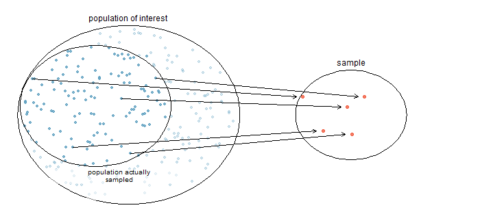
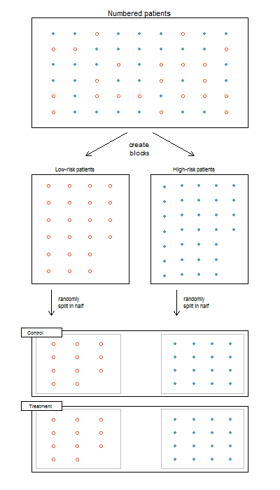
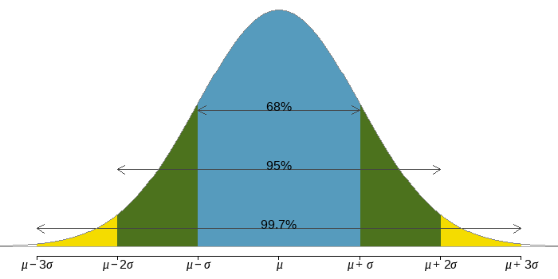

--- 
title: "Introduction to Statistics"
author: "Amlan Banerjee, Ph.D."
date: "`r Sys.Date()`"
site: bookdown::bookdown_site
documentclass: book
output: 
  bookdown::gitbook:
          config:
            fontsettings: 
              theme: 'white'
              family: 'serif'
              size: 3
            download: ["book.pdf"]
---


```{r setup, include=FALSE}
knitr::opts_chunk$set(echo = FALSE)
```


# Course Information

The purpose of this elementary statistics course is to introduce students to the relationship between statistics and the world through use of a wide variety of real applications that bring life to theory and methods.

## Course Description

The course covers sampling methods, classification of data, probability, frequency and probability distributions, confidence intervals, tests of statistical significance, and simple regression and correlation.

## Course Outcomes

Upon successful completion of this course, the student will be able to:

1.	Interpret quantitative data using graphs and descriptive statistics with emphasis on histograms and boxplots.
2.	Compute measures of expectation and variation for a discrete probability distribution
3.	Compute probability for a binomial and normal distribution.
4.	Perform calculations to estimate parameters using confidence intervals based on the normal distribution and $t$-distribution.
5.	Perform hypotheses testing involving a sample mean, proportion, and standard deviation/variance
6.	Perform hypotheses testing involving two sample means (independent and dependent), two population proportions, and two standard deviations/variances.
7.	Construct linear regression models and correlation coefficients from datasets.


<!--chapter:end:index.Rmd-->

# Introduction 


**Learning Outcome:**

---
*Select a suitable sampling design {simple random, systematic, stratified, cluster}, given information about the observational study or experiment.*  
---

The chapter introduces various data types, sampling techniques, sampling errors, two main types of statistical studies, namely observational studies and experiments. Also discussed here are their benefits and drawbacks and how to design them well.


## What is Statistics?

The science of planning studies and experiments; obtaining data; and organizing, summarizing, presenting, analyzing, and interpreting those data and then drawing conclusions based on them.

Application of statistics is literally everywhere - business, finance, engineering, health science, social science, environmental science, politics, education, and so on.


## Statistical Thinking

Statistical studies are designed by the following five steps:

1. Raise a precise question about one or more variables.

2. Design a plan to answer the question.

3. Collect the data.

4. Analyze the data.

5. Draw a conclusion from the data about the question.


#### Definitions {-}

**Data** are collections of obervations, such as measurements or survey responses. 

**Variable** is a characteristics of the individuals to be measured or observed.

**Population** is the complete collection of all measurements or data that are being considered. Typically, a population is the complete collection of data that we would like to make inference about. 

**Census** is the collection of data from every member of the population.

**Sampling Frame** is a numbered list of all the individuals in the population from which a sample is drawn.

**Sample** is a sub-collection of members selected from a population.

**Population Parameter** is a numerical measurement describing some characteristics of a population.

**Sample Statistic** is a numerical measurement describing some characteristics of a sample.


Example (parameter vs. statistic): 

There are $17,246,372$  high school students in the U.S. In a study of $8505$ U.S. high school students $16$ years of age or older, $44.5\%$ of them said that they texted while driving at least once during the previous $30$ days.


1. Parameter: What percent of the population texted while driving? (unknown)
2. Statistic: $44.5\%$


## Types of Data or Variable

<span style="color:#386cb0">
**Categorical (or Qualitative)** </span> - consist of names or labels (not numbers that represent counts or measurements)

#### Levels of Measurement of Qualitative Data {-}


**- Nominal (unordered):** the data fall into categories that have no particular order or ranking in relation to each other, e.g., <br> 
color (blue, green, red,...), <br>
gender (male, female),        <br>
nationality (American, Canadian, Mexican,...)

**- Ordinal (ordered):**  values have a natural order to ranking, but differences either can't be found or are meaningless e.g., <br>
temperature (low, medium, high),  <br> 
exam grade (A, B, C, D, F), <br>
satisfaction (high, neutral, low) 


<span style="color:#386cb0">
**Numerical (or Quantitative)** </span> - consist of numbers representing measurements or counts.

**- Continuous:** a subject or observation takes a value from an interval of real numbers, e.g., weight, height, age, etc. Continuous (numerical) data result from infinitely many possible quantitative values, where the collection of values is not countable, such as the lengths of distances from $0$ inch to $12$ inch. 


**- Discrete:** a subject or observation takes certain values from a finite set, e.g. population, traffic volume, etc. Discrete data result when values are quantitative and the number of values is finite, or "countable", such as the number of tosses of a coin before getting tails. 


#### Levels of Measurement of Quantitative Data {-}


**Interval Variables:** these variables are measured along a continuum, and they have the property that equal differences between measures represent equal differences in the values of the variable. Therefore, differences are meaningful, but there is no natural zero starting point and ratios are meaningless. For example, temperature is measured in degrees Celsius. So the difference between $20^\circ C$ and $30^\circ C$ is the same as $30^\circ C$ to $40^\circ C$. However, $0^\circ C$ does not mean there is no temperature. Also, $\dfrac{40^\circ C}{20^\circ C} = 2$ does not mean $40^\circ C$ is twice the warmer than $20^\circ C$. Similarly the years 2021 and when you were born, say 1981, can be arranged in order, and the difference of $40$ years can be found and is meaningful. However, time did not begin in year $0$, so the year $0$ is arbitrary instead of being a natural zero starting point representing "no time".


**Ratio Variables:** these variables have all the properties of interval variables, but in addition have the property that there is a natural zero starting point and the ratios make sense. Examples of ratio variables include height, mass, distance, time etc. The name "ratio" reflects the fact that you can use the ratio of measurements. So, for example, a distance of $10$ meters is twice the distance of $5$ meters, and the measurement of distance starts at $0$.


## Sampling Methods


### Sampling from a Population {-}

Because populations are often very large, a common objective of the use of statistics is to obtain data from a sample and then use those data to form a conclusion about the population.

```{r surveySample, echo=F, out.width = "900px"}

```

**Example:** Identify the Variable, Sample, and Population of a Study

In a poll of $1000$ randomly selected American adults, $48\%$ of respondents said that they strongly disapprove of the way Congress is doing its job. The study then made an inference about all American adults.

a. Define the variable of the study.
b. Identify the sample.
c. Identify the population.


### Simple Random Sampling (SRS)

A simple random sample of $n$ subjects is selected in such a way that every possible sample of the sample size $n$ has the same chance of being chosen.

---
In statistics a sample of a population is said to be **random** if each member in the population has an equal chance of being chosen.
---


**Sampling with replacement** -  an individual is selected more than once.

**Sampling without replacement** - an individual is selected only once.


```{r, echo=FALSE, message=FALSE, warning=FALSE}
library(openintro)
source("SamplingMethodsFunctions.R")
data(COL)
N   <- sample(100:200, 1)
n   <- sample(20:50, 1)
colSamp <- COL[4]
PCH <- rep(c(1, 3, 20)[3], 3)

col <- rep(COL[1], N)
pch <- PCH[match(col, COL)]

BuildSRS()
```

^*Source: OpenIntro.Org*^


### Stratified Sampling

1. The population is divided into <span style="color:#b2182b"> **non-overlapping, homogeneous** </span> subgroups called <span style="color:#b2182b"> **strata** </span>.
2. Then, SRS is employed to select a certain number or a certain proportion of the whole within each stratum.

```{r echo=FALSE, message=FALSE, warning=FALSE}
BuildStratified()
```

^*Source: OpenIntro.Org*^


**Example: Stratified Sampling** (*Optional*)

Design a sample to survey $500$ students using stratified sampling method.

$$ \text { Strata Sizes }  
\bbox[white,4px]
{
\color{black}
{
\begin{array}{c|c|c|c}
\text{Gender}  & \text{Undergraduate} & \text{Graduate} & \text{Total} \\
\hline
\text{Female} & \text{3355} & \text{4693} & \text{8048} \\
\text{Male} & \text{3734} & \text{6687} & \text{10421} \\
\hline
\text{Total} & \text{7089} & \text{11380} & \text{18469} \\
\end{array}
}
}
$$

$$ \text { Strata Proportions } 
\bbox[yellow,4px]
{
\color{black}
{
\begin{array}{c|c|c|c}
\text{Gender}  & \text{Undergraduate} & \text{Graduate} & \text{Total} \\
\hline
\text{Female} & \text{3355/18469 = .182} & \text{.254} & \text{.436} \\
\text{Male} & \text{.202} & \text{.362} & \text{.564} \\
\hline
\text{Total} & \text{.384} & \text{.616} & \text{1.000} \\
\end{array}
}
}
$$

$$ \text { Sample sizes }   
\bbox[lightblue,4px]
{
\color{black}
{
\begin{array}{c|c|c|c}
\text{Gender}  & \text{Undergraduate} & \text{Graduate} & \text{Total} \\
\hline
\text{Female} & \text{.182(500)=91} & \text{127} & \text{218} \\
\text{Male} & \text{101} & \text{181} & \text{282} \\
\hline
\text{Total} & \text{192} & \text{308} & \text{500} \\
\end{array}
}
}
$$

**Practice**

Design a sample to survey $1200$ students using stratified sampling method.


$$  
\bbox[white,4px]
{
\color{black}
{
\begin{array}{c|c|c|c}
\text{Gender}  & \text{Undergraduate} & \text{Graduate} & \text{Professional} \\
\hline
\text{Female} & \text{10588} & \text{4475} & \text{1421} \\
\text{Male} & \text{7762} & \text{3736} & \text{1153} \\
\hline
\end{array}
}
}
$$

### Cluster Sampling

1. The population is often divided into <span style="color:#b2182b"> **non-overlapping mutually homogeneous yet internally heterogeneous**</span> subgroups called <span style="color:#b2182b"> **clusters.** </span> Cluster sampling is much like SRS, but instead of randomly selecting *individuals*, SRS is applied to select clusters.
    + In other words, unlike stratified sampling, cluster sampling is most helpful when there is a lot of case-to-case variability within a cluster but the clusters themselves don't look very different from one another. That is, we expect strata to be <span style="color:#b2182b"> **self-similar (homogeneous),** </span> while we expect clusters to be <span style="color:#b2182b"> **diverse (heterogeneous).** </span>
2. The elements in each cluster are then sampled. If all elements in each sampled cluster are sampled, then this is referred to as a <span style="color:#b2182b"> **"one-stage" cluster sampling plan.** </span>
3. Sometimes cluster sampling can be a more economical random sampling technique
than the alternatives. For example, if neighborhoods represented clusters, this sampling
method works best when each neighborhood is very diverse. Because each neighborhood
itself encompasses diversity, a cluster sample can reduce the time and cost associated with
data collection, because the interviewer would need only go to some of the neighborhoods
rather than to all parts of a city, in order to collect a useful sample.
  

**One-Stage Cluster Sampling**  

```{r, echo=FALSE, message=FALSE, warning=FALSE}
BuildCluster()
```

^*Source: OpenIntro.Org*^

**Multistage Cluster Sampling**

A <span style="color:#b2182b"> **"multistage" or "multistage cluster"** </span> sampling is an extention of cluster sampling and involves two (or more) steps.    

1. First step is to take a cluster sample.
2. Then, instead of including all of the individuals in these clusters in the sample, a second sampling method,
usually SRS, is employed within each of the selected clusters.   

In the neighborhood example, we could first randomly select some number of neighborhoods and then take a SRS from just those selected neighborhoods. As seen in Figure, stratified sampling requires observations to be sampled from every stratum. Multistage sampling selects observations only from those clusters that were randomly selected in the first step.   


It is also possible to have more than two steps in multistage sampling. Each cluster may be naturally divided into subclusters. For example, each neighborhood could be
divided into streets. To take a three-stage sample, we could first select some number of clusters (neighborhoods), and then, within the selected clusters, select some number of
subclusters (streets). Finally, we could select some number of individuals from each of the selected streets.

```{r, echo=FALSE, message=FALSE, warning=FALSE}
BuildMultistage()
```

^*Source: OpenIntro.Org*^


### Nonrandom Sampling

<span style="color:#386cb0"> **Systematic Sampling** </span>   

Select every $k^{th}$ individual froma list of the population, where the position of the first person chosen is randomly selected from the $k$ individuals. This will give a non-representative sample if there is a structure to the list.

```{r, echo=FALSE, message=FALSE, warning=FALSE}
BuildSystematic()
```

^*Source: OpenIntro.Org*^

**Solve:**

The human resource department at a certain company wants to conduct a survey regarding worker benefits. The department has an alphabetical list of all $5465$ employees at the company and wants to conduct a systematic sample of size $60$.

(a)  What is $k$?


(b)  Determine the individuals who will be administered the survey. Randomly select a number from $1$ to $k$.  Suppose that we randomly select $10$. Starting with the first individual selected, the individuals in the survey will be 


<span style="color:#386cb0"> **Convenience or Volunteer Sampling** </span>   
Use the first $n$ individuals that are available or the individuals who volunteer to participate. This is almost sure to give a non-representative sample which cannot be generalized to the population.


**Exercise: Identifying Sampling Methods**

1. A researcher randomly selects 20 Taco Bell locations and surveys all the employees at those locations.

2. A news station hosts a call-in survey about whether physician-assisted death should be legalized in all states.

3. A researcher randomly selects an LED TV out of the first 200 LED TVs on an assembly line and also selects every 200th LED TV after that.

4. In a study at a community college, 30 instructors are randomly selected from fulltime instructors and 50 instructors are selected from part-time instructors.

5. The City Hall of Spring Hill, Kansas, creates a frame of its 5730 residents and randomly selects 60 residents.
 


---

**Example: Non-Representative Sample** 

<div class="centered">  </div>   


**Survey**   

* Surveyed 10 million people who were subcribers or had telephones.
* 2.4 million people responded (i.e. 24% response rate)

**Prediction**       
Landslide victory of Landon.

**Election Result**    
Landslide victory of Roosevelt.

**What did go wrong with the poll?**

* Sample was drawn from telephone directories, club membership, magazine subscibers, etc. who were upper middle class people, largely excluding poor unemployed people. 
* The sample suffered from both selection and nonresponse bias.

---


## Sampling Errors


#### Statistical Inference {-}

**Inferential Statistics** is the practice of using information from a sample to draw conclusions about the entire population. 


It is the process of making judgments about the parameters of a population and the reliability of statistical relationships, typically on the basis of random sampling.   

$\require{AMScd}$
        $$
        \begin{CD}
        Sample @> {\text {statistical inference}} >> Population
        \end{CD}
        $$

$$\underbrace{\text {sample statistics}}_{\text{investigator knows}} = \underbrace{\text {population parameter}}_{\text{investigator wants to know}} + \underbrace{\text {bias}}_{\text{nonsampling error}} + \underbrace{\text {chance variation}}_{\text{random sampling error}}
$$


<span style="color:#386cb0"> **Random Sampling Error** </span> - occurs when the sample has been selected with a random method, but there is a discrepancy between a sample result and the true population result.

<span style="color:#386cb0"> **Non-sampling Error** </span> - is the results of human error, including such factors as wrong data entries, computing errors, questions with biased wording, false data provided by respondents, forming biased conclusions, or applying statistical methods that are not appropriate for the circumstances.

A sampling method that consistently underestimates or overestimates some characteristics of the population is said to be **biased**.

* **Selection/Sampling bias** - occurs when the sample is selected in such a way that it systematically excludes or underrepresented part of the population.
    * An online survey conducted to estimate the percentage of Americans who have a Facebook account.
    * The survey is biased because people who go online are favored.
    * People who never go online cannot participate in the poll.

* **Nonresponse bias** - occurs when responses are not obtained from all individuals selected for inclusion in a sample. It happens if individuals refuse to be part of the study or if the research cannot track down individuals identified to be in the sample.

* **Measurement or response bias** - occurs when the data are collected in such a way that it tends to result in observed values that are different from the actual value in some systematic way. Contributing factors: question wording and order; mode of survey; influence of the interviewer; people might exaggerate how much money they earn; or a researcher might record the information incorrectly etc.

Response bias can also result from the wording of questions. For example, compare the impact of the following two questions:

1. Do you brag about your past successes with others?
2. Do you inspire others by sharing your past successes?
3. Do you share your past successes with others?

  
<span style="color:#386cb0"> **Nonrandom Sampling Error** </span> - is the results of using a sampling method that is not random, such as using a convenience sample or a voluntary response sample.


## Bias and Precision

**Bias**  
The average difference between the estimator and the true value.   

**Precision**   
The standard deviation of the estimator. 

<div class="centered"> 

```{r echo=F, out.width = "400px"}
knitr::include_graphics("bias versus precision.png")
```
</div>


$$
\begin{aligned}
\text{Mean Squared Error, MSE} &= precision^2 + bias^2 \\
\text{Root Mean Squared Error, RMSE} &= \sqrt{MSE}
\end{aligned}
$$


---

### Statistical Studies {-}

**Explanatory and Response Variables**

In statistical studies, we want to know whether a variable $x$ explains (or affects) another variables $y$.
The $x$ variable is called the ***explanatory or independent variable***.
The $y$ variable is called the ***response or dependent variable***.


**Association vs. Causation**

There is an ***association*** between an explanatory and response variable when the response variable changes as the explanatory variable changes.

If the change in the explanatory variable *causes* the change in the response variable, then there is a ***causation*** between the variables.

---


## Observational Studies 

Generally, data in observational studies are collected on specific characteristics only by passively monitoring study participants, but the observers don't attempt to modify the individuals being studied. These studies are inexpensive and good for discovering relationships related to rare outcomes. They are generally only sufficient to show associations.    


Types of observational studies:

<span style="color:#386cb0"> **1. Cross-sectional Studies** </span>
- data are observed, measured, and collected at one point in time, not over a period of time.

<span style="color:#386cb0"> **2. Retrospective Studies** </span>
- data are collected from a past time period by going back in time (through examinations of records, interviews, and so on).

<span style="color:#386cb0"> **3. Prospective (or longitudinal or cohort) Studies** </span>
- data are collected in  the future from groups that share common factors (such groups are called cohorts).


**Observational Study: drinking coffee and longevity**

Coffee drinkers may live longer - *nytimes.com, May 16, 2012.*       

Coffee may help you live longer, study suggests - *thestar.com, May 17, 2012.*    

No, drinking coffee probably won't make you live longer - *washingtonpost.com, May 17, 2012.*

Association of coffee drinking with total and cause-specific mortality," *New England Journal of Medicine*, May 2012.  

Sample Size: **400,000**

Age Range: **50-71** years   

Period: **1995 - 2008**    

Death: **52,000** 

How would you interpret the result?


#### Confounding Variable {-}

A **confounding variable** is a variable that is associated with both the explanatory and response variables. Simultaneously with the explanatory variable, it may cause the response variable to change during the study. Because of the confounding variable's association with both variables, we do not know if the response is due to the explanatory variable or due to the confounding variable.

```{r, eval = F, echo=FALSE, message=FALSE, warning=FALSE, include=FALSE}
require(visNetwork, quietly = TRUE)
nodes <- data.frame(id = 1:3, label = c('sun exposure',
                                        'use sunscreen',
                                        'skin cancer'))
edges <- data.frame(from = c(1,1,2), to = c(3,2,3),
                    label = c('','','?'))

# visNetwork(nodes, edges, width = "100%")
network <- visNetwork(nodes, edges, width = "100%") %>% 
    visEdges(shadow = FALSE,
             arrows =list(to = list(enabled = TRUE, scaleFactor = 1)),
             color = list(color = "lightblue", highlight = "red")) %>%
    visLayout(randomSeed = 12) 
    # visInteraction(dragNodes = FALSE, dragView = FALSE, zoomView = FALSE)
visSave(network, file = "network.html")
```
</br>

<div class="centered">

```{r echo=FALSE}
knitr::include_graphics("confound_1.png")
```
</div>

**Sun exposure** is a confounding factor because it is associated with both the use of
sunscreen and the development of skin cancer. People who are out in the sun all day are
more likely to use sunscreen, and people who are out in the sun all day are more likely to get
skin cancer.


#### Lurking Variable {-}

**Lurking variables** are variables that are not considered in the analysis, but may affect the nature of the relationship between the explanatory variable and the outcome.           

<div class="centered">  

Table: 20-year survival status of women by smoking status         


$$
\begin{array}{c|lcr}
& \text{Smoker} \\
& \text{Yes} & \text{No} \\
\hline
\text {Dead} & 0.239 & 0.314 \\
\text {Alive} & 0.761 & 0.686
\end{array}
$$


**Are smokers less likely to die?**

```{r echo=FALSE}
knitr::include_graphics("lurking var - smokers.png")
```


## Experimental Design

While observational studies are effective tools for answering certain research questions, experiments are essential to measure the effect of a treatment. In an experiment, we apply some treatment and then proceed to observe its effects on the individuals.  

**Subject:** Entity who is participating in the study.

**Treatment Group:** The group of subjects that receives treatments.

**Control Group:**  The group of subjects that receives no treatment.

**Response Variable:** The outcome of interest, measured on each subject. 

**Factor:** The categorical variable that explains the outcome of the experiment. Each category is called <span style="color:#386cb0"> **level.** </span>

**Blinding:** When researchers keep the subjects uninformed about their treatment, the study is said to be **blind**. Its purpose is to reduce the potential for both researchers' and subjects' emotional bias.   

* Subjects would not know which experimental group they are assigned to. 
* The researcher (i.e. the person who is measuring the outcome) would not know which treatment is assigned to which experimental unit.

<span style="color:#386cb0"> **Single-blind:** </span> only one type of blinding is applied.     
<span style="color:#386cb0"> **Double-blind:** </span> both types of blinding are applied.     

**Placebo:** A substance or treatment with no active ingredients. The control group receives the placebo treatment.        

This phenomenon, in which the recipient perceives an improvement in condition due to personal expectations, rather than the treatment itself, is known as the **placebo effect.**


#### Principles of Experimental Design {-}

Well-conducted experiments are built on three main principles.

<span style="color:#386cb0"> **Direct Control** </span>

Researchers assign treatments to cases, and they do their best to control any other differences in the groups. They want the groups to be as identical as possible *except for the treatment*, so that at the end of the experiment any difference in response between the groups can be attributed to the treatment and not to some other confounding or lurking variable. **Direct control refers to variables that the researcher can control.**

<span style="color:#386cb0"> **Randomization** </span>

Researchers randomize patients into treatment groups to account for variables that cannot be controlled. Randomizing patients into the treatment or control group helps even out the effects of such differences, and it also prevents accidental bias from entering the study.

<span style="color:#386cb0"> **Replication** </span>     

In a single study, replication is done by imposing the treatment on a sufficiently large number of subjects or experimental units. Scientists may also replicate the entire experiment on an entirely different population of experimental units to verify earlier findings.


### Randomized Blocked Design

Researchers sometimes know or suspect that another variable, other than the treatment, influences the response. Under these circumstances, they may carry out a **blocked experiment.** In this design, they first group individuals into **blocks** based on the identified variable (in other words, form blocks or groups of subjects with similar characteristics) and then randomize subjects within each block to the treatment groups. This strategy is referred to as **blocking.** For example, blocks can be designed based on gender or age group of subjects.




### Completely Randomized Experimental Design

A **completely randomized experimental design** is one in which the subjects or experimental units are randomly assigned to each group in the experiment.     

         

^*Source: OpenIntro.Org*^


**Case Study 1: PATRICIA Study | PApilloma TRIal against Cancer In young Adults**

^*The Lancet, Volume 374, Issue 9686, Pages 301 - 314, 25 July 2009*^    

Efficacy of human papillomavirus (HPV) - 16/18 AS04-adjuvanted vaccine against cervical infection and precancer caused by oncogenic HPV types (PATRICIA); final analysis of a **double-blind, randomized study in young women.**

^*Paavonen, et. al.*^


$$
\begin{array}{c|c}
{\text{Response Variable} \\ \text {(Acquired an infection)}}  & {\text{Explanatory Variable} \\ \text{(Given the HPV vaccine)}} \\
\hline
\text{Yes} & \text{Yes} \\
\text{No} & \text{No} \\
\end{array}
$$


$$ \bbox[yellow,5px]
{
\color{black}
{
\begin{array}{c}
{\text{Factor 1} \\ \text{(2 Levels)}} \\
\hline
\text{Drug A} \\
\text{Drug B} 
\end{array}
}
}
$$


$$ \bbox[silver,5px]
{
\color{black}
{
\begin{array}{c}
{\text{Factor 2} \\ \text{(2 Levels)}} \\
\hline
\text{Dose A} \\
\text{Dose B} 
\end{array}
}
}
$$


$$ \bbox[5px,border:2px solid red]
{
\begin{array}{c}
\text{4 Treatments} \\
\hline
\text{Drug A & Dose A}\\
\text{Drug A & Dose B}\\
\text{Drug B & Dose A}\\
\text{Drug B & Dose B}
\end{array}
}
$$


**Case Study 2: Ischemic Preconditioning | Effect on Muscular Endurance**

Can Ischemic Preconditioning improve athletic performance?     

1. Experimental units: 40 male teenagers
2. Response Variable: length of time a wall squat position can be held
3. Control Groups: 2 groups who received 0 lb pressure
4. Control of Extraneous Factors: Age, sex, athletic ability
5. Randomization: Randomly assigned 10 experimental units to each of 4 treatment groups


$$ \bbox[yellow,5px]
{
\color{black}
{
\begin{array}{c|c}
\text{Factor1}  & {\text{Amount of pressure} \\ \text{applied by the} \\ \text{bloodpressure cuff}} \\
\hline
\text{Level 1} & \text{20 lb} \\
\text{Level 2} & \text{0 lb} \\
\end{array}
}
}
$$

$$ \bbox[silver,5px]
{
\color{black}
{
\begin{array}{c|c}
\text{Factor2}  & {\text{Length of time pressure} \\ \text{was applied}} \\
\hline
\text{Level 1} & \text{10 min} \\
\text{Level 2} & \text{20 min} \\
\end{array}
}
}
$$


$$ \bbox[5px,border:2px solid red]
{
\begin{array}{c}
\text{4 Treatments} \\
\hline
\text{20 lb/10 min}\\
\text{20 lb/20 min}\\
\text{0 lb/ 10 min}\\
\text{0 lb/ 20 min}
\end{array}
}
$$


**Components of a Well-Designed Study**

* There should be a control group and at least one treatment group.
* Individuals should be randomly assigned to the control and treatment group(s).
* The sample size should be large enough.
* A placebo should be used when appropriate.
* The study should be double-blind when possible. If this is impossible, then the study should be single-blind if possible.


**Practice: Identifying an Experiment and an Observational Study**

Identify whether the study is an experiment or an observational study. Discuss whether the components of a good study were used.

For five years, the author taught an innovative intermediate algebra course in which students learned by working in groups. Then the author compared the proportion of his successful intermediate algebra students who passed trigonometry with the proportion of other professors' successful intermediate algebra students who passed trigonometry.


**Practice: Redesign an Observational Study into a Well-Designed Experiment**

A researcher wants to determine whether taking vitamin C helps people avoid getting the flu and the common cold. She randomly selects 100 people and asks them whether they take vitamin C and how often they had the flu or a cold in the past year. The researcher analyzes the responses and concludes that vitamin C helps people avoid the flu and colds.

1. Describe some problems with the observational study. Include in your description at least one possible lurking or confounding variable and identify which type it is.

2. Redesign the study so that it is a well-designed experiment.


<!--chapter:end:02-intro.Rmd-->

# Exploring Data with Tables and Graphs


**Learning Outcome:**

---
*Interpret quantitative data using tables and graphs, and descriptive statistics using histograms.* 
---

The chapter introduces various techniques such as frequency table and histogram to organize quantitative data to explore its important characteristics.


## Frequency Distribution


$\text {Table: Drive-Through Service Times (seconds) for McDonald's Lunches}$


A **frequency distribution (or frequency table)** shows how data are partitioned among several categories (or classes) by listing the categories along with the number (frequency) of data values in each of them.


$$  
\bbox[white,4px]
{
\color{black}
{
\begin{array}{c|c|c|c} 
\text{Time(Seconds)}  & \text{Frequency}  \\
\hline
\text{75-124} & \text{11}  \\
\text{125-174} & \text{24}  \\
\text{175-224} & \text{10}  \\
\text{225-274} & \text{3}  \\
\text{275-324} & \text{2}  \\
\hline
\text{Total} & 50
\end{array}
}
}
$$

Lower class limits: ${75, 125, 175, 225, 275}$  
Upper class limits: ${124, 174, 224, 274, 324}$  
Class boundaries: ${74.5, 124,5, 174.5, 224.5, 274.5, 324.5}$  
Class midpoints: ${99.5, 149.5, 199.5, 249.5, 299.5}$  
Class width: $124.5 - 74.5 = 50$  


#### Relative Frequency Distribution {-}

A **relative frequency distribution (or percentage frequency distribution)** is a variation of the basic frequency distribution in which a class frequency is replaced by a relative frequency (or proportion). 


$$
\begin{align}
\text{relative frequency for a class} &= \dfrac{\text{frequency for a class}}{\text{sum of all frequencies}} \\
\text{percentage of a class} &= \dfrac{\text{frequency for a class}}{\text{sum of all frequencies}} \times 100\%\\
\end{align}
$$


$$
\bbox[white,4px]
{
\color{black}
{
\begin{array}{c|c} 
\text{Time(Seconds)}  & \text{Relative  Frequency}  \\
\hline
\text{75-124}  & \text{22}\%  \\
\text{125-174} & \text{48}\%  \\
\text{175-224} & \text{20}\%  \\
\text{225-274} & \text{6}\%   \\
\text{275-324} & \text{4}\%   \\
\hline
               & 100\% 
\end{array}
}
}
$$


#### Cumulative Distribution {-}


$$
\bbox[white,4px]
{
\color{black}
{
\begin{array}{c|c|c} 
\text{Time(Seconds)}  & \text{N}  & \text{%}  \\
\hline
\text{75-124}  & 11 & \text{22}\%  \\
\text{125-174} & 35 & \text{70}\%  \\
\text{175-224} & 45 & \text{90}\%  \\
\text{225-274} & 48 & \text{96}\%   \\
\text{275-324} & 50 & \text{100}\%   \\
\hline
\end{array}
}
}
$$


## Histogram 

A histogram is a graph consisting of bars of equal width drawn adjacent to each other. The horizontal scale represents classes of quantitative data values; and the vertical scale represents frequencies.

A **relative frequency histogram** has the same shape and horizontal scale as a histogram, but the vertical scale uses relative frequencies (as percentages) instead of actual frequencies.


```{r include=FALSE}
library(dplyr)
library(ggplot2)
library(tidyverse)
library(showtext)
library(patchwork)
library(plotly)

font_add_google("Lobster Two", "lobstertwo")
font_add_google("Roboto", "roboto")
font_add_google("Poppins", "poppins")
showtext_auto()


theme_set(theme_bw())
theme_update(
  legend.text = element_text(size=30, family = "roboto"),
  legend.title = element_text(face="bold", size=30, family = "roboto"),
  legend.position = c(1,0),
  legend.justification = c(1, 0),
  text = element_text(family = "Poppins", size = 30, color = "black"),
  plot.title = element_text(family = "Poppins", size = 30,
                            face = "bold", color="#2a475e"),
  plot.subtitle = element_text(family = "Poppins", size = 24, 
                               face = "bold", color="#1b2838"),
  plot.caption = element_text(size = 24),
  plot.title.position = "plot",
  #plot.caption.position = "plot",
  axis.text = element_text(size = 24, color = "black"),
  axis.title = element_text(size =24),
  axis.ticks = element_blank(),
  axis.line = element_line(colour = "grey50"),
  rect = element_blank(),
  panel.grid = element_line(color = "#b4aea9"),
  panel.grid.minor = element_blank(),
  panel.grid.major.x = element_blank(),
  #panel.grid.major.x = element_line(linetype="dashed"),
  #panel.grid.major.y = element_blank(),
  panel.grid.major.y = element_line(linetype="dashed"),
  plot.background = element_rect(fill = '#fbf9f4', color = '#fbf9f4')
)


mcd <- c(107, 139, 197, 209, 281, 254, 163, 150, 127, 308, 206, 187, 169,  83, 127, 133, 140,
          143, 130, 144,  91, 113, 153, 255, 252, 200, 117, 167, 148, 184, 123, 153, 155, 154,
          100, 117, 101, 138, 186, 196, 146,  90, 144, 119, 135, 151, 197, 171, 190, 169)
mcd <- data.frame(mcd)
```

```{r echo=FALSE, message=FALSE, warning=FALSE}
p1 <- ggplot(data=mcd, aes(x=mcd)) + 
  geom_histogram(breaks=c(75, 125, 175, 225, 275, 325), 
                 col="red", 
                 fill="green", 
                 alpha = .2) + 
  labs(title = "Frequency", x="Times (sec)", y="Count") + 
  xlim(c(75,325))  
  # ylim(c(0,30))


p2 <- ggplot(data=mcd, aes(x=mcd)) + 
  geom_histogram(aes(y = stat(count) / sum(count)*100), 
                     breaks=c(75, 125, 175, 225, 275, 325), 
                 col="red", 
                 fill="green", 
                 alpha = .2) + 
  labs(title = "Relative Frequency", x="Times (sec)", y="Percent of Total") + 
  xlim(c(75,325))  


p1 + p2 +
  plot_layout(guides = "collect") +
  plot_annotation(title = "Histogram: Drive-Through Service Times (seconds)")
```

**Importance of Histogram**

* Visually displays the shape of the distribution of the data  
* Shows the location of the center of the data  
* Shows the spread of the data   
* Identifies outliers


#### Density Histogram {-}


$$
\begin{align}
\textbf{Density} &= \dfrac{\textbf{relative frequency}}{\textbf{bin width}} \\
\text {Density of class (75-124)}
&= \dfrac{\text{rel. freq of class (75-124)}}{\text{class width}} \\
&= \dfrac{0.22}{50}   \\                         
&= 0.0044
\end{align}
$$


```{r echo=FALSE, message=FALSE, warning=FALSE}
ggplot(data=mcd, aes(x=mcd, y=..density..)) + 
  geom_histogram(breaks=c(75, 125, 175, 225, 275, 325), 
                 col="red", 
                 fill="green", 
                 alpha = .2) + 
  labs(title = "Density Histogram", x="Times (sec)", y="Density") + 
  xlim(c(75,325))  
  # ylim(c(0,30))
```


In density histogram, area of each rectangular bar is the relative frequency of its class. 


**Practice - Construct a Density Histogram**

The accompanying frequency distribution summarizes data on the number of times smokers attempted to quit before their final successful attempts.

$$ \bbox[yellow,5px]
{
\color{black}
{
\begin{array}{r|c}
\text{Number of attempts} & \text{Frequency} \\
\hline
\textbf{0-10} & 778 \\
\textbf{10-20} & 306 \\
\textbf{20-30} & 274  \\
\textbf{30-40} & 221 \\
\textbf{40-50} & 238 
\end{array}
}
}
$$


## Other Charts

**Dotplot**

A dotplot uses dots to show the frequency, or number of occurrences, of the values in a data set. The higher the stack of dots, the greater the number of occurrences there are of the corresponding value.

```{r echo=FALSE, message=FALSE, warning=FALSE, comment=NA}
df <- c(70,
        80,
        75,
        75,
        50,
        70,
        65,
        65,
        70,
        85,
        75,
        80,
        70,
        65); df <- as.data.frame(df)
ggplot(df, aes(x = df)) + geom_dotplot(method="histodot") + labs(title = "Dotplot", x = "") +
    scale_y_continuous(NULL, breaks = NULL)
```


**Pie Charts**

The distribution of a categorical variable can be described by a **pie chart**, which is a disk where slices represent the categories. The proportion of the total area for one slice is equal to the relative frequency for the category represented by the slice. The relative frequencies are usually written as percentages.

Example 1: Construct and Interpret a Pie Chart

A total of 273 children were surveyed about what job they would want to do. The jobs and the percentages of the children who voted for them are shown in the table. 

$$ \bbox[yellow,5px]
{
\color{black}
{
\begin{array}{r|c}
\text{Job} & \text{Percent} \\
\hline
\text{Spy/Agent} & 16 \\
\text{Veterinarian} & 13 \\
\text{Professional Athlete} & 12  \\
\text{Movie Star} & 10 \\
\text{Video Game Designer} & 8 \\
\text{Doctor} & 6 \\
\text{Other} & 35 
\end{array}
}
}
$$


```{r echo=FALSE, message=F, warning=FALSE}
library(ggplot2)
library(dplyr)
df <- data.frame(
  group = c("Spy/Agent", "Veterinarian", "Prof. Athlete", "Movie Star", "Video Game Desiner", "Doctor", "Other"),
  value = c(16, 13, 12, 10, 8, 6, 35)
  )

df <- df %>%
  arrange(desc(group)) %>%
  mutate(lab.ypos = cumsum(value) - 0.5*value)

mycols <- c("#0073C2FF", "#EFC000FF", "#868686FF", "#CD534CFF", "darkgreen", "darkorange", "#56B4E9")

ggplot(df, aes(x = "", y = value, fill = group)) +
      geom_bar(width = 1, stat = "identity", color = "white") +
      coord_polar("y", start = 0)+
      geom_text(aes(y = lab.ypos, label = value), color = "white") +
      scale_fill_manual(values = mycols) +
      theme_void()
```

Questions:

1. Find the proportion of the observations that fall in the spy category.

2. Find the proportion of the observations that do NOT fall in the spy category.

3. Find the proportion of the observations that fall in the athlete category OR fall in the movie-star category.


**Interpreting a Multiple Bar Graph**

In a survey in 2012, 1960 adults were asked the following question: "Generally speaking, do you usually think of yourself as a Republican, Democrat, Independent, or other?" The results of the survey are described by the multiple bar graph. 


```{r echo=FALSE, message=F, warning=FALSE}
Party <- c("Democrats", "Independent", "Republican", "Other")
Women <- c(.37, .38, .23, .02)
Men <- c(.29, .43, .24, .03)

data <- data.frame(Party, Women, Men)

p <- data %>% 
  plot_ly() %>%
  add_trace(x = ~Party, y = ~Women, type = 'bar', 
             text = Women, textposition = 'auto',
             name = "Women",
             marker = list(color = 'rgb(158,202,225)',
                           line = list(color = 'rgb(8,48,107)', width = 1.5))) %>%
  add_trace(x = ~Party, y = ~Men, type = 'bar', 
            text = Men, textposition = 'auto',
            name = "Men",
            marker = list(color = 'rgb(58,200,225)',
                          line = list(color = 'rgb(8,48,107)', width = 1.5))) %>%
  layout(barmode = 'group',
         xaxis = list(title = "Party"),
         yaxis = list(title = "Relative Frequency")) 
p
```


1. What proportion of women thought of themselves as Democrats?

2. Which political party did the greatest proportion of men choose?

3. Compare the proportion of women who thought of themselves as Independents to the proportion of men who thought of themselves as Independents.

4. A total of 1081 women and 879 men responded to the survey. Were there more women or men who thought of themselves as Independents? How is this possible, given there was a smaller proportion of women who thought of themselves as Independents than men?


**Two-Way (Contingency) Table**

The table summarizes the responses from all 42 students who participated in the survey about whether they had read a novel in the past year.

$$ \bbox[yellow,5px]
{
\color{black}
{
\begin{array}{l|c|c|c}
\text{Gender} & \text{Did Not Read Novel} & \text{Read Novel} & \text{Total}  \\
\hline
\text{Female} & 6 & 19 & 25 \\
\text{Male} & 6 & 11 & 17 \\
\hline 
\text{Total} & 12 & 30 & 42 \\
\hline 
\end{array}
}
}
$$

1. How many of the students read a novel in the past year?
2. What proportion of the students did not read a novel in the past year?
3. What proportion of the women read a novel in the past year?
4. What proportion of the students is men AND read a novel in the past year?


<!--chapter:end:03-exploring_data.Rmd-->

# Describing, Exploring, and Comparing Data


**Learning Outcome:**

---
Calculate measures of central tendency, position, and spread, including standard deviation. Interpret quantitative data using graphs and descriptive statistics with emphasis on histograms and boxplots.
---

In this chapter, we will numerically describe distributions of quantitative variables. Distributions, such as histograms, can be described by three characteristics:  shape, center, and spread.


```{r include=FALSE}
library(dplyr)
library(ggplot2)
library(tidyverse)
library(showtext)
library(patchwork)
library(plotly)

font_add_google("Lobster Two", "lobstertwo")
font_add_google("Roboto", "roboto")
font_add_google("Poppins", "poppins")
showtext_auto()


theme_set(theme_bw())
theme_update(
  legend.text = element_text(size=30, family = "roboto"),
  legend.title = element_text(face="bold", size=30, family = "roboto"),
  legend.position = c(1,0),
  legend.justification = c(1, 0),
  text = element_text(family = "Poppins", size = 30, color = "black"),
  plot.title = element_text(family = "Poppins", size = 30,
                            face = "bold", color="#2a475e"),
  plot.subtitle = element_text(family = "Poppins", size = 24, 
                               face = "bold", color="#1b2838"),
  plot.caption = element_text(size = 24),
  plot.title.position = "plot",
  #plot.caption.position = "plot",
  axis.text = element_text(size = 24, color = "black"),
  axis.title = element_text(size =24),
  axis.ticks = element_blank(),
  axis.line = element_line(colour = "grey50"),
  rect = element_blank(),
  panel.grid = element_line(color = "#b4aea9"),
  panel.grid.minor = element_blank(),
  panel.grid.major.x = element_blank(),
  #panel.grid.major.x = element_line(linetype="dashed"),
  #panel.grid.major.y = element_blank(),
  panel.grid.major.y = element_line(linetype="dashed"),
  plot.background = element_rect(fill = '#fbf9f4', color = '#fbf9f4')
)
```


## Measures of Shape

**Modes**

The **mode** of some data is an observation with the greatest frequency. There can be more than one mode, but if all the observations have frequency 1, then there is no mode.

**Mode is represented by a prominent peak in the distribution.**


**Unimodel Distribution**


```{r echo=FALSE, message=FALSE, warning=FALSE, comment=NA}
 set.seed(1234)                            # include seed for same samples
 n = 50000
 y1 = rnorm(n, 10, 1)
 hist(y1, probability = T, ylim=c(0,0.5), col="skyblue2", main="", xlab="", 
      cex.lab=3, cex.axis=3, cex.main=3, cex.sub=3)
 curve(dnorm(x,10,1), lwd=2, col="blue", add=T)
```


**Bimodal Distribution** 


```{r echo=FALSE, message=FALSE, warning=FALSE, comment=NA}
# https://math.stackexchange.com/questions/2149570/how-to-generate-sample-from-bimodal-distribution
set.seed(12345)                            # include seed for same samples
n = 20000;  u1 = rbeta(n, .5, .5)           # 2000 wasteful, but simple
cond = u1 > .01 & u1 < .99                   
v1 = u1[cond];  x1 = v1[1:10000]             # truncate and use 500
n = 20000; y1 = rnorm(n, 5, 2);  y2 = rnorm(n, 10, 1)  # same SD
w = rbinom(n, 1, .5)                     
x2 = w*y1 + (1-w)*y2                      
par(mfrow=c(1,2))                       
  hist(x1, prob=T, col="skyblue2", xlab="", main="", 
       cex.lab=3, cex.axis=3, cex.main=3, cex.sub=3)
    k = diff(pbeta(c(.01,.99),.5,.5))      # adj for truncation
    curve((1/k)*dbeta(x, .5, .5),.01,.99, lwd=2, col="blue", add=T)
  hist(x2, prob=T, col="skyblue2", ylim=c(0,.2), xlab="", main="", breaks = 25, 
       cex.lab=3, cex.axis=3, cex.main=3, cex.sub=3)
    curve(.5*dnorm(x,5,2)+.5*dnorm(x,10,1), lwd=2, col="blue", add=T)
par(mfrow=c(1,2))                        # return to default single panel
```


**Multimodal Distribution** 


```{r echo=FALSE, message=FALSE, warning=FALSE, comment=NA}
set.seed(123456)                            # include seed for same samples
n = 20000
y1 = rnorm(n, 0, 3);  y2 = rnorm(n, 10, 2);  y3 = rnorm(n, 20, 1) # same SD
w1 = rbinom(n, 1, .5)
w2 = rbinom(n, 1, .5)
x2 = w1*y1 + (1-w1)*y2 + w2*y3                      
hist(x2, prob=T, col="skyblue2",ylim=c(0,0.05), xlab="", main="", breaks = 50,
     cex.lab=3, cex.axis=3, cex.main=3, cex.sub=3)
    # curve(0.4*dnorm(x,0,1)+0.2*dnorm(x,5,1)+0.4*dnorm(x,10,1), lwd=2, col="blue", add=T)
```


 **Uniform Distribution** 
 
All the bins have the same frequency, or at least close to the same frequency. It is a distribution without a mode.


```{r echo=FALSE, message=FALSE, warning=FALSE, comment=NA}
set.seed(1234567)                            # include seed for same samples
x <- runif(20000)
hist(x, prob=T, col="skyblue2", main="", xlab="", cex.lab=3, cex.axis=3, cex.main=3, cex.sub=3)
```

**Symmetry**

The histogram for a **symmetric** distribution will look the same on the left and the right of its center.

```{r echo=FALSE, message=FALSE, warning=FALSE, comment=NA}
set.seed(12345)                            # include seed for same samples
n = 10000;  u1 = rbeta(n, .5, .5)           # 2000 wasteful, but simple
cond = u1 > .01 & u1 < .99                   
v1 = u1[cond];  x1 = v1[1:10000]             # truncate and use 500

n = 10000; y1 = rnorm(n, 2, 2);  y2 = rnorm(n, 12, 2)  # same SD
w = rbinom(n, 1, .5)                     
x2 = w*y1 + (1-w)*y2                      

n = 20000;  u3 = rbeta(n, 2, 6)           # 2000 wasteful, but simple
cond = u3 > .01 & u3 < .99                   
v3 = u3[cond];  x3 = v3[1:10000]             # truncate and use 500

par(mfrow=c(1,3))                       
  hist(x1, prob=T, col="skyblue2", main="Symmetric", breaks = 10, xlab="",
       cex.lab=3, cex.axis=3, cex.main=3, cex.sub=3)
    k = diff(pbeta(c(.01,.99),.5,.5))      # adj for truncation
    curve((1/k)*dbeta(x, .5, .5),.01,.99, lwd=2, col="blue", add=T)
  hist(x2, prob=T, col="skyblue2",ylim=c(0,.1), main="Symmetric", breaks = 20, xlab="", 
       cex.lab=3, cex.axis=3, cex.main=3, cex.sub=3)
    curve(.5*dnorm(x,2,2)+.5*dnorm(x,12,2), lwd=2, col="blue", add=T)
 hist(x3, prob=T, col="skyblue2", main="Asymmetric", breaks = 10, xlab="", 
      cex.lab=3, cex.axis=3, cex.main=3, cex.sub=3)
    k = diff(pbeta(c(.01,.99),2,6))      # adj for truncation
    curve((1/k)*dbeta(x, 2, 6),.01,.99, lwd=2, col="blue", add=T)
par(mfrow=c(1,3))                        # return to default single panel
```

**Skew**

* A histogram is **skewed right** if the longer tail is on the right side of the mode.
* A histogram is **skewed left** if the longer tail is on the left side of the mode.

```{r echo=FALSE, message=FALSE, warning=FALSE, comment=NA}
set.seed(23456)                      
n = 20000;  u3 = rbeta(n, 2, 6)           
cond = u3 > .01 & u3 < .99                   
v3 = u3[cond];  x3 = v3[1:10000]            

n = 20000;  u4 = rbeta(n, 6, 2)           
cond = u4 > .01 & u4 < .99                   
v4 = u4[cond];  x4 = v4[1:10000]             

par(mfrow=c(1,2))                       
 hist(x3, prob=T, col="skyblue2", main="Skewed Right", breaks = 10, xlab="", 
      cex.lab=3, cex.axis=3, cex.main=3, cex.sub=3)
    k = diff(pbeta(c(.01,.99),2,6))      # adj for truncation
    curve((1/k)*dbeta(x, 2, 6),.01,.99, lwd=2, col="blue", add=T)
 hist(x4, prob=T, col="skyblue2", main="Skewed Left", breaks = 10, xlab="", 
      cex.lab=3, cex.axis=3, cex.main=3, cex.sub=3)
    k = diff(pbeta(c(.01,.99),6,2))      # adj for truncation
    curve((1/k)*dbeta(x, 6, 2),.01,.99, lwd=2, col="blue", add=T)
par(mfrow=c(1,2))                        # return to default single panel
```

**Outlier**

* An Outlier is a data value that is far above or far below the rest of the data values.
   
```{r echo=FALSE, message=FALSE, warning=FALSE, comment=NA}
library(openintro)
ggplot(data=email50, aes(x=num_char)) + 
  geom_histogram(col="red", 
                 fill="green", 
                 alpha = .2) + 
  labs(title = "Histogram with Outliers", x="", y="Frequency")
```

## Measures of Center


#### Mean {-}

The sample mean of a numerical variable is computed as the sum of all of the observations $\{x_1, x_2, \cdots, x_n\}$ divided by the number of observations $(n)$.

If $\bar x$ is the mean, then


$$
\displaystyle (\bar x - x_1) + (\bar x - x_2) + \cdots + (\bar x - x_n) = 0 \\
\displaystyle \text{Therefore}, \ \bar x = \frac{(x_1+x_2+...+x_n)}{n} = \dfrac{1}{n}\sum_{i=1}^n x_i
$$


The mean follows the tail

- In a ***right skewed*** distribution, the mean is greater than the median.
- In a ***left skewed*** distribution, the mean is less than the median.
- In a ***symmetric*** distribution, the mean and median are approximately equal.


#### Median {-}

The median splits an ordered data set in half. If there are an even number of observations, the median is the average of the two middle
values. If there are an odd number of observations, the median is the middle value.


```{r echo=FALSE, message=FALSE, warning=FALSE, comment=NA}
# Mathjax ref: https://math.meta.stackexchange.com/questions/5020/mathjax-basic-tutorial-and-quick-reference
library(openintro)
library(knitr)
library(DT)
library(xtable)
library(pracma)

sort <- sort(round(email50$num_char))
sort <- matrix(unlist(sort), ncol = 10, byrow = TRUE)
prmatrix(sort,rowlab=rep("",5),collab=rep("",10))
```


```{r echo=FALSE, message=FALSE, warning=FALSE, comment=NA}
ggplot(data=email50, aes(x=num_char)) + 
  geom_histogram(col="red", 
                 fill="green", 
                 alpha = .2) + 
  labs(title = "Median = 7, Mean = 12", x="", y="Frequency") + 
      geom_vline(aes(xintercept=mean(num_char, na.rm=T)),   
               color="red", linetype="dashed", size=1) + 
      geom_vline(aes(xintercept=median(num_char, na.rm=T)),
               color="blue", linetype="dashed", size=1) 
```


**Calculating the Median**

<span style="color:#386cb0"> $n$ is odd </span>


1. Sort the series in ascending order.  
2. If the series has odd number $(n)$ of entries, the median is at position $\frac{n+1}{2}.$  
3. Find the median of the series: $2,4,5,(6),7,9,9$  
4. The median is $6.$  


<span style="color:#386cb0"> $n$ is even </span>


1. Sort the series in ascending order.  
2. If the series has even number $(n)$ of entries, the median is the average of the two middle numbers: $\frac{n}{2},\frac{n+1}{2}.$  
3. Find the median of the numbers: $2,2,4,6,7,8$  
4. Median is the average of the third and the fourth numbers: $\frac{4+6}{2}=5$  


Example: Comparing the Medians of Two Distributions

$$
\begin{array}{lclc}
\text{Pacific State} & \text{Minimum Wage} & \text{Mountain State} & \text{Minimum Wage} \\
\hline
\text {Alaska} & 7.75 & \text {Arizona} & 7.90 \\
\text {California} & 8.00 & \text {Colorado} & 8.00 \\
\text {Hawaii} & 7.25 & \text {Idaho} & 7.25 \\
\text {Oregon} & 9.10 & \text {Montana} & 7.90 \\
\text {Washington} & 9.32 & \text {Nevada} & 8.25 \\
                  &       & \text {New Mexico} & 7.50 \\
                  &       & \text {Utah} & 7.25 \\
                  &       & \text {Wyoming} & 5.15 \\
\end{array}
$$

Find the median minimum wages of the Pacific and Mountain states. 


**How the Shape of a Distribution Affects the Mean and the Median**

* If a distribution is **skewed left**, the mean is usually less than the median and the median is usually a better measure of the center.

* If a distribution is **symmetric**, the mean is approximately equal to the median and both are reasonable measures of the center.

* If a distribution is **skewed right**, the mean is usually greater than the median and the median is usually a better measure of the center.


List: ${2,3,3,4}$   


```{r echo=FALSE, message=FALSE, warning=FALSE, comment=NA}
list <- c(2,3,3,4) 
ggplot(data=as.data.frame(list), aes(x=list)) + 
  geom_histogram(breaks=c(1,2,3,4,5),
                 col="red", 
                 fill="green", 
                 alpha = .2) + 
  labs(title = "median = mean = 3", x="", y="Frequency")
```

List: $2,3,3,7$   


```{r echo=FALSE, message=FALSE, warning=FALSE, comment=NA}
list <- c(2,3,3,7) 
ggplot(data=as.data.frame(list), aes(x=list)) + 
  geom_histogram(breaks=c(1,2,3,4,5,6,7),
                 col="red", 
                 fill="green", 
                 alpha = .2) + 
  labs(title = "median = 3 mean = 3.75", x="", y="Frequency")
```
 
$\textbf {Notice: The median is unaffected by outliers.}$


#### Weighted Mean {-}

The weighted mean is the same as the mean,  except that it is influenced more by some observations than others. We assign weights to observations as a sort of way of describing its relative importance.

The weighted mean of observations $x_1, x_2,...,x_n$ using weights $w_1, w_2,...,w_n$ is given by   

$\displaystyle \bar x =\frac{w_1x_1+w_2x_2+...+w_nx_n}{w_1+w_2+...+w_n}$


<div class="red4"> 
The simple mean is a weighted mean where all the weights are 1.
</div>


$\displaystyle \bar x =\frac{1\times x_1+1\times x_2+...+1\times x_n}{1+1+...+1} = \frac{x_1+x_2+...+x_n}{n}$ 


#### Calculating Mean from a Frequency Distribution {-}

$$
\bar x = \dfrac{\sum (f \cdot x)}{\sum f}
$$

where, $f$ is the class frequency and $x$ is the class midpoint.

$$  
\bbox[white,4px]
{
\color{black}
{
\begin{array}{c|c|c|c} 
\text{Time(Seconds)}  & \text{Frequency } f & \text{Class Midpoint } x & f \cdot x  \\
\hline
\text{75-124}  & 11 &  99.5  & 1094.5  \\
\text{125-174} & 24 & 149.5  & 3588.0  \\
\text{175-224} & 10 & 199.5  & 1995.0  \\
\text{225-274} & 3  & 249.5  &  748.5   \\
\text{275-324} & 2  & 299.5  &  599.0   \\
\hline
\text{Total} & \sum f = 50   &  & \sum(f \cdot x) = 8025.0 \\
\end{array}
}
}
$$

$$
\displaystyle \bar x =  \dfrac{\sum (f \cdot x)}{\sum f} = \dfrac{8025.0}{50} = 160.5
$$


#### Midrange {-}

The **midrange** of a data set is the measure of center that is the value midway between the maximum and minimum values in the original data set. It is found by adding the maximum data value to the minimum data value and then dividing the sum by $2$, as the following formula:

$$
\text {Midrange} = \dfrac{\text{maximum data value + minimum data value}}{2}
$$


## Measures of Spread or Variation

#### Range {-}

The **range** of a set of data is the difference between the maximum and the minimum data values. <br/>  


<span style="color:#386cb0">
$\textbf {range = maximum - minimum}$
</span>

The range is sensitive to outliers. A single high or low value will affect the range significantly.


#### Standard Deviation of a Sample {-}

* SD $(s)$ of a set of sample values is a measure of how much, on average, the data values deviate away from the sample mean.
* In other word, SD describes the variability of the data set within the range of the dataset.
    + Low variability or small spread means that the values tend to be more clustered together.
    + High variability or large spread means that the values tend to be far apart.
    
  
**Calculating the Standard Deviation**


The standard deviation is the square root of the variance. It is roughly the average distance of the observations from the mean.

$$ \bbox[yellow,5px]
{
\color{black}{s= \sqrt{\frac{1}{n-1}\sum(x_i-\bar x)^2}}
}
$$

Exercise:

$1. Calculate \space SD \space of \space [0,1]$


$2. Calculate \space SD \space of \space [30,20, 41, 21]$


**Which histogram has the largest SD?**

```{r echo=FALSE, message=FALSE, warning=FALSE, comment=NA}
set.seed(23456)                            # include seed for same samples
n = 500000
 y1 = rnorm(n, 0, 1)
 y2 = rnorm(n, 0, 3)
 y3 = rnorm(n, 0, 5)
 par(mfrow=c(1,3))                        # return to default single panel
 hist(y1, probability = T, ylim=c(0,0.4), col="skyblue", 
            cex.lab=3, cex.axis=3, cex.main=3, cex.sub=3, 
      main = paste0("N(",round(mean(y1),0),",",round(sd(y1),0),")"))
    curve(dnorm(x,0,1), lwd=2, col="blue", add=T)
 hist(y2, probability = T, ylim=c(0,0.4), col="skyblue2", 
            cex.lab=3, cex.axis=3, cex.main=3, cex.sub=3,
      main = paste0("N(",round(mean(y2),0),",",round(sd(y2),0),")"))
    curve(dnorm(x,0,3), lwd=2, col="blue", add=T)
 hist(y3, probability = T, ylim=c(0,0.4), col="skyblue2", 
            cex.lab=3, cex.axis=3, cex.main=3, cex.sub=3,
      main = paste0("N(",round(mean(y3),0),",",round(sd(y3),0),")"))
    curve(dnorm(x,0,5), lwd=2, col="blue", add=T)
 par(mfrow=c(1,3))                        # return to default single panel
```

Hint: pay attention to the range of the distributions.


#### Calculating Standard Deviation from a Frequency Distribution {-}


$\text {Step 1: Calculate weighted average from the class midpoint and class frequency}$


$$
\bar x = \dfrac{\sum (f \cdot x)}{\sum f}
$$

where, $f$ is the class frequency and $x$ is the class midpoint.

$$  
\bbox[white,4px]
{
\color{black}
{
\begin{array}{c|c|c|c} 
\text{Time(Seconds)}  & \text{Frequency } f & \text{Class Midpoint } x & f \cdot x  \\
\hline
\text{75-124}  & 11 &  99.5  & 1094.5  \\
\text{125-174} & 24 & 149.5  & 3588.0  \\
\text{175-224} & 10 & 199.5  & 1995.0  \\
\text{225-274} & 3  & 249.5  &  748.5   \\
\text{275-324} & 2  & 299.5  &  599.0   \\
\hline
\text{Total} & \sum f = 50   &  & \sum(f \cdot x) = 8025.0 \\
\end{array}
}
}
$$

$$
\displaystyle \bar x =  \dfrac{\sum (f \cdot x)}{\sum f} = \dfrac{8025.0}{50} = 160.5
$$

$\text {Step 2: Calculate variance}$

$$
\displaystyle s^2 = \dfrac{1}{\sum_{i} f_i - 1}\sum_{i} f_i(x_i - \bar x)^2
$$


$$  
\bbox[white,4px]
{
\color{black}
{
\begin{array}{c|c|c|c} 
\text{Time(Seconds)}  & \text{Frequency } f & \text{Class Midpoint } x & f_i(x_i - \bar x)^2  \\
\hline
\text{75-124}  & 11 &  99.5  & 40931  \\
\text{125-174} & 24 & 149.5  & 2904  \\
\text{175-224} & 10 & 199.5  & 15210  \\
\text{225-274} & 3  & 249.5  & 23763   \\
\text{275-324} & 2  & 299.5  & 38642   \\
\hline
\text{Total} & \sum f = 50   &  & \sum f_i(x_i - \bar x)^2 = 121450 \\
\end{array}
}
}
$$


$$
\begin{align}
s^2 &= \dfrac{121450}{50-1} = 2478.6  \\
\end{align}
$$


$\text {Step 3: Calculate standard deviation}$


$$
\begin{align}
s &= \sqrt {2478.6} = 49.8
\end{align}
$$


#### Standard Deviation of a Population {-}

$$ \bbox[yellow,5px]
{
\color{black}{\sigma= \sqrt{\frac{1}{N}\sum(x_i-\mu)^2}}
}
$$


#### Variance of a Sample and Population {-}

The **variance** of a set of values is a measure of variation equal to the square of the standard variation.

* Sample variance: $s^2 =$ square of the sample standard deviation $s$.
* Population variance: $\sigma^2 =$ square of the population standard deviation $\sigma$.


---

**Why is $(n-1)$ used to calculate standard deviation?**

$s` = \sqrt{\frac{1}{n}\sum(x_i-\bar x)^2}$ is not an unbiased estimator of the population standard deviation $\sigma$, meaning that the distribution of $s$ does not tend to center around $\sigma$. Therefore, an adjustment is applied by replacing $n$ by $(n-1)$ in the denominator.

$s = \sqrt{\frac{1}{n-1}\sum(x_i-\bar x)^2}$ is an unbiased estimator of $\sigma$.


Also, with division by $n-1$, sample variance $s^2$ tend to center around the value of the population variance $\sigma^2$; with division by $n$, sample variances $s^2$ tend to underestimate the value of the population variance $\sigma^2$.  

---

#### Coefficient of Variation {-}


The **coefficient of variation (CV)** for a set of non-negative sample or population data, expressed as a percent, describes the standard deviation relative to the mean, and is given by the following:

$$
Sample: CV = \frac{s}{x}.100 \\
Population: CV = \frac{\sigma}{x}.100
$$


## Normal Distribution and Standard Deviation

Probabilities for falling 1, 2, and 3 standard deviations of the mean in a normal distribution.

```{r message=FALSE, warning=FALSE, comment=NA, include=FALSE}
library(openintro)
data(COL)

myPNG("6895997.png", 700, 350,
      mar = c(2, 0, 0, 0))
X <- seq(-4, 4, 0.01)
Y <- dnorm(X)
plot(X, Y,
     type = 'n',
     axes = FALSE,
     xlim = c(-3.2, 3.2),
     ylim = c(0, 0.4))
abline(h = 0, col = COL[6])
at <- -3:3
labels <- expression(mu - 3 * sigma,
                     mu - 2 * sigma,
                     mu - sigma,
                     mu,
                     mu + sigma,
                     mu + 2 * sigma,
                     mu + 3 * sigma)
axis(1, at, labels)
for (i in 3:1) {
  these <- (i - 1 <= X & X <= i)
  polygon(c(i - 1, X[these], i),
          c(0, Y[these], 0),
          col = COL[i],
          border = COL[i])
  these <- (-i <= X & X <= -i + 1)
  polygon(c(-i, X[these], -i + 1),
          c(0, Y[these], 0),
          col = COL[i],
          border = COL[i])
}

# _____ Label 99.7 _____ #
arrows(-3, 0.03,
       3, 0.03,
       code = 3,
       col = '#444444',
       length = 0.15)
text(0, 0.02, '99.7%', pos = 3)

# _____ Label 95 _____ #
arrows(-2, 0.13,
       2, 0.13,
       code = 3,
       col = '#444444',
       length = 0.15)
text(0, 0.12, '95%', pos = 3)

# _____ Label 68 _____ #
arrows(-1, 0.23,
       1, 0.23,
       code = 3,
       col = '#444444',
       length = 0.15)
text(0, 0.22, '68%', pos = 3)

lines(X, Y, col = '#888888')
abline(h = 0, col = '#AAAAAA')
dev.off()
```

```{r, message=FALSE, warning=FALSE, comment=NA, out.width = "800px"}

```


**Empirical Rule of Normal Distribution**

$$
\begin{array}{lc}
\text{Interval} & \text{Percent} \\
\hline
\mu \pm \sigma & 68 \% \\
\mu \pm 2\sigma & 95 \% \\
\mu \pm 3\sigma & 99.7 \% \\
\hline
\end{array}
$$


### z-score {-}

A **z-score** (or **standard score** or **standardized value**) is the number of standard deviations that a given value $x$ is above or below the mean. The $z$ score is calculated by using one of the following:


$$z= \dfrac{x-\bar x}{s}$$

$$
\begin{align}
x = \bar x - 2s  &\implies  z = -2  \\
x = \bar x - s  &\implies  z = -1  \\
x = \bar x &\implies z = 0  \\
x = \bar x + s  &\implies  z = +1  \\
x = \bar x + 2s  &\implies  z = +2  \\
\end{align}
$$

Note: $z$-score is useful in comparing two variables measured on different scales.  

Example: The $4000$ g weight of a newborn baby (among 400 weighs with sample mean $\bar x = 3152.0$ g and sample standard deviation $s = 693.4$ g) 


$$
z = \dfrac{x - \bar x}{s} = \dfrac{4000 - 3152.0}{693.4} = 1.22
$$
The weight $4000$ g is $1.22$ standard  deviations away from the mean.


## Percentiles and Quartiles

- Percentiles are measures of location, denoted $P_1, P_2, \cdots, P_{99}$, which divide a set of data into $100$ groups with about $1\%$ of the values in each group.
- Example - the $50$th percentile, denoted $P_{50}$ has about $50\%$ of the data values below it and about $50\%$ of the data value above it.
- The **$n^{th}$ percentile** is the data value such that $n$ percent of the data lies below that value and $(100-n)$ percent of the data falls above that value.  

$$
\text{Percentile of value } x = \frac{\text{number of values less than } x}{\text{total number of values}} \times 100
$$

#### Finding a Percentile {-}


$\text {Table: Data Speeds (mbps) at Various Airports}$


**Find the percentile for the data of 11.8 mbps.**


There are $50$ data speeds in the table.
There are $20$ data speeds less than $11.8$ mbps.

$\therefore$  percentile of $11.8 = \dfrac{20}{50} \cdot 100 = 40$


Interpretation: A data speed of $11.8$ mbps is in the $40$th percentile. This means $40\%$ of the airports reported data speeds less than $11.8$ mbps.


**Find the 40th percentile.**

First, compute the locator, $L = \dfrac{k}{100} \cdot n = \dfrac{40}{100} \cdot 50 = 20.$ 
By definition, $P_{40}$ below which $40\%$ of the data points fall. Hence, the $40$th percentile is midway between the $20$th and $21$st value. In the table above, $20th$ value is $11.6$ and $21$st value is $11.8$, so the midway between them is $11.7$ mbps. 

$\therefore P_{40} = 11.7$ mbps.


**Find the 25th percentile.**


$L = \dfrac{k}{100} \cdot n = \dfrac{25}{100} \cdot 50 = 12.5.$ 

In this case, we round up the value of $L$ to get $13$ to make sure at least $12.5\%$ data points fall below that point.

$\therefore P_{25} = 7.9$ mbps.


**Three Quartiles $(Q_1, Q_2, Q_3)$**  


+ $Q_1$ represents the **first quartile**, which is the 25th percentile, and is the median of the smaller half of the data set. 
+ $Q_2$ represents the **second quartile**, which is equivalent to the 50th percentile (i.e. the median).
+ $Q_3$ represents the **third quartile**, or 75th percentile, and is the median of the larger half of the data set   
+ Interquartile Range $(IQR) = Q_3 - Q_1$   


## Boxplot


#### 5-Number Summary {-}

For a set of data, the **5-number summary** consists of five values:

1. minimum
2. first quartile, $Q_1$
3. second quartile (median), $Q_2$
4. third quartile, $Q_3$
5. Maximum


A **boxplot** (or **box-and-whisker diagram**) is a graph of a data set that consists of a line extending from the minimum value to the maximum value, and a box with lines drawn at the first quartile $(Q_1)$, the median $(Q_2)$, and the third quartile $(Q_3)$.


#### Outlier and Fences {-}

When in the context of a box plot, define an outlier as an observation that 

+ right fence: $$ > Q_3 + 1.5 \times IQR $$

+ left fence: $$ < Q_1 - 1.5 \times IQR $$

Such points are marked using a dot or asterisk in a box plot.


**Example:**

Data: **$[5, 5, 9, 10, 15, 16, 20, 30, 40]$**

**Five Number Summary:**
```{r echo=FALSE, message=FALSE, warning=FALSE, comment=NA}
x <- c(5, 5, 9, 10, 15, 16, 20, 30, 40)
# cat(x)
summary(x) # FIve Number Summary
Q1 <- quantile(x, probs = 0.25)
Q3 <- quantile(x, probs = 0.75)
IQR <- quantile(x, probs = 0.75) - quantile(x, probs = 0.25)
upper_fence <- Q3 + 1.5*IQR # Upper Fence 
lower_fence <- Q1 - 1.5*IQR # Lower Fence
a <- c("upper fence: Q3 + (1.5)IQR = ", upper_fence[[1]])
b <- c("lower fence: Q1 - (1.5)IQR = ", lower_fence[[1]])
#cat(c(a,"   ",b))
par(mfrow=c(2,1))  
boxplot(x, horizontal = T, col = 'orange', main = "Boxplot with outliers (UF = 36.5; LF = -7.5)",
        cex.lab=3, cex.axis=3, cex.main=3, cex.sub=3)
    abline(v = upper_fence, col = "red")
    abline(v = lower_fence, col = "red")     
boxplot(x, horizontal = T, col = 'orange', outline=F, main = "Modified Boxplot without outliers",
        cex.lab=3, cex.axis=3, cex.main=3, cex.sub=3)
par(mfrow=c(2,1))
```


**Exercise: Drawing a Boxplot with an Outlier**

Students in one of the author's statistics classes were surveyed about the number of novels they read in the past year. Here are the anonymous responses (in numbers of novels) of 11 of the students: 

$[2, 5, 2, 0, 2, 3, 0, 5, 6, 4, 12]$

1. Construct a boxplot.
2. Check if there is any outlier. 


## Group Comparison

Comparing distributions of median household income for counties by population gain status


```{r, message=FALSE, warning=FALSE, include=FALSE}
library(openintro)
# data(countyComplete)
data(COL)

cc  <- read.csv("C:/Users/abanerjee/OneDrive - National Education Association/Amlan/PGCC/pathway_to_statistics/cc.csv")
pop <- sign(cc$pop2010 - cc$pop2000 - 0.5)
pov <- cc$median_val_owner_occupied / 1000

pop[pop == 1] <- "gain"
pop[pop == -1] <- "no gain"


myPNG("countyIncomeSplitByPopGain.png", 700, 350,
      mar = c(3.6, 3.6, 1, 0.5),
      mgp = c(2.4, 0.7, 0),
      mfrow = 1:2)
boxPlot(pov, pop,
        xlab = 'Change in Population',
        ylab = 'Median Income ($1000s)',
        lcol = "#00000000",
        col = "#00000000", ylim = c(0,400))
boxPlot(pov[pop == "gain"],
        lcol = COL[1],
        col = COL[1,3],
        add = 1)
boxPlot(pov[pop == "no gain"],
        lcol = COL[4],
        col = COL[4,3],
        add = 2)

par(mar = c(3.6, 0.5, 1, 1))

histPlot(pov[pop == 'no gain'],
         breaks = 50,
         col = '#ffffff00',
         border = COL[4],
         probability = TRUE,
         xlab = 'Median Income ($1000s)',
         ylab = '',
         hollow = TRUE,
         axes = FALSE,
         lty = 3,
         lwd = 4,
         xlim = range(pov))
histPlot(pov[pop == 'no gain'],
         breaks = 50,
         col = '#ffffff00',
         border = COL[4],
         probability = TRUE,
         add = TRUE,
         hollow = TRUE,
         lty = 3,
         lwd = 2)
histPlot(pov[pop == 'no gain'],
         breaks = 50,
         col = '#ffffff00',
         border = COL[4],
         probability = TRUE,
         add = TRUE,
         hollow = TRUE,
         lty = 3,
         lwd = 1)
histPlot(pov[pop == 'gain'],
         breaks = 50,
         col = '#ffffff00',
         border = COL[1],
         probability = TRUE,
         add = TRUE,
         hollow = TRUE,
         lty = 1,
         lwd = 2)
axis(1)
legend('topright',
       col = COL[c(1,4)],
       lty = c(1,3),
       lwd = c(2,2.8),
       legend = c('gain', 'no gain'))
legend('topright',
       col = c(rgb(0,0,0,0), COL[4]),
       lty = c(1, 3),
       lwd = c(2,1.4),
       legend = c('gain', 'no gain'),
       bg = rgb(0,0,0,0),
       box.col = rgb(0,0,0,0),
       text.col = rgb(0,0,0,0))
legend('topright',
       col = c(rgb(0,0,0,0), COL[4]),
       lty = c(1, 3),
       lwd = c(2,0.7),
       legend = c('gain', 'no gain'),
       bg = rgb(0,0,0,0),
       box.col = rgb(0,0,0,0),
       text.col = rgb(0,0,0,0))
dev.off()
```


^*Source: OpenIntroOrg*^

<!--chapter:end:04-describing_data.Rmd-->

# Discrete Probability Distributions


**Learning Outcome**

---
Compute measures of expectation and variation for a discrete probability distribution.
---


In this chapter, we will extend the concept of relative frequencies to understand and calculate the probability of occurrence of a random event. We will also learn about normal distribution, its properties, and methods to calculate probabilities of random events that are described by this distribution.


## Definitions

An **event** is any collection of results or outcomes of a procedure.
For example, tossing a coin is an event with possible outcomes *heads* and *tails*.

A **simple event** is an event that has one outcome. For example, births of $2$ girls followed by a boy is a simple event because the only possible outcome is $\{ggb\}$. 

However, births of $2$ girls **and** a boy is an event that has three possible outcomes 
$\{ggb, gbg, bgg \}$.

A **sample space** for a procedure consists of all possible simple events. 
For example, with births of three children, the sample space consists of eight different simple events $\{ bbb, bbg, bgb, bgg, gbb, gbg, ggb, ggg\}$  


An event is **random** if individual outcomes of it are unpredictable, meaning they have no apparent pattern of occurrence,  but there is nonetheless a predictable distribution (i.e. the frequencies) of those different outcomes over a large number of repetitions of the event.    

The **probability** of any outcome of a random event can be defined as the proportion of times the outcome would occur in a very long series of repetitions.  

The probability is defined as a proportion, and it always takes values between $0$ and $1$ (inclusively). It may also be displayed as a percentage between $0\%$ and $100\%$.    

* $0\%: \text{event is impossible}$
* $100\%: \text{event is certain}$


</br>


**THEORETICAL VERSUS EXPERIMENTAL PROBABILITY**


The ***Theoretical*** probability is the likelihood of occurring of an event. It is simply the ratio of the number of desired outcomes and the number of all possible outcomes. 


The ***experimental probability*** is an estimate of the likelihood of occurring of an event based on repeated trials. 


The ***subjective probability*** is an estimate of the likelihood of occurring of an event based on someone's belief. 


</br>


<span style="color:#08519c"> **LAW OF LARGE NUMBERS** </span> 

---
Consider: **Rolling a 1 of a die**

If the sample space of a random experiment consists of $n$ equally likely outcomes and an event $E$ consists of $m$ of those outcomes, then

$$\text {Theorerical Probability} : P(E) = \frac{\text{number of outcomes in the event}(m)}{\text{total number of outcomes}(n)}$$

Let $\hat{p_n}$ be the proportion of outcomes that are $1$ after the $n$ rolls. As the number of rolls $(n)$ increases, $\hat{p_n}$ (the relative frequency of rolls, or the experimental probability) will converge to the theoretical probability of rolling a $1,\space p = 1/6.$ The figure shows the convergence for $100,000$ die rolls. 

The tendency of $\hat{p_n}$ to stabilize around $p$, i.e. the tendency of the relative frequency to stabilize around the true probability, is described by the **Law of Large Numbers.**     


As more observations are collected, the observed proportion $\hat{p_n}$ of occurrences with a particular outcome after $n$ trials converges to the true probability $p$ of that outcome. 


```{r, echo=FALSE, message=FALSE, warning=FALSE, include=FALSE}
library(openintro)
data(COL)
# _____ Simulate _____ #
n <- 10^5
x <- sample(0:1, n, TRUE, p = c(5 / 6, 1 / 6))
y <- cumsum(x) / 1:n
X <- c(1:100, seq(102, 500, 2),
	seq(510, 1500, 10), seq(1550, 10000, 50),
	seq(10100, 25000, 100), seq(25250, 100000, 250))
Y <- y[X]

# _____ Plotting _____ #
myPNG('dieProp.png', 700, 420,
      mar = c(3.8, 3.8, 0.5, 0.5))
plot(X, Y,
     log = 'x',
     type = 'l',
     xlab = '',
     ylab = '',
     axes = FALSE,
     col = COL[1],
     lwd = 1.5)
mtext('n (number of rolls)', side = 1, line = 2.5)
abline(h = 1 / 6, lty = 2)
at <- 10^(0:5)
labels <- c('1', '10', '100', '1,000', '10,000', '100,000')
axis(1, at, labels, cex.axis = 0.9)
axis(2, cex.axis = 0.9)
at <- 1 / 6
labels <- expression(paste(hat(p)[n]))
axis(2, at, labels,
     line = 2.3,
     tick = FALSE,
     cex.axis = 1.1)
dev.off()
```

**Die Rolls Simulation**

```{r echo=FALSE, out.width = "650px"}

```

The figure shows the fraction of die rolls that are $1$ at each stage in a simulation.
The relative frequency tends to get closer to the probability $1/6 \approx 0.167$ as
the number of rolls increases.
---

**Example: Calculating Classical Probabilities**

Assuming that births of boys and girls are equally likely, find the probability of getting children of all of the same gender when three children are born.  

Recall the sample space of three children: $\{ bbb, bbg, bgb, bgg, gbb, gbg, ggb, ggg \}$, includes eight equally likely outcomes, and there are exactly two outcomes in which three children are of the same gender: $\{ bbb, ggg \}$ .   

$$
P(\text{ three children of the same gender}) = \dfrac{2}{8} = \dfrac{1}{4} = 0.25
$$


## Finding Probabilities  

This section presents the addition and multiplication rules of calculating probabilities.

### Disjoint or mutually exclusive outcomes

Two events or outcomes are called  **disjoint or mutually exclusive** if they cannot both happen in the same trial.    
 
When rolling a die, the outcomes $1$ and $2$ are disjoint, and we compute the probability that one of these outcomes will occur by adding their separate probabilities:
$$P(1 \text{ or } 2)=P(1)+P(2)=1/6+1/6=1/3$$

**What about the probability of rolling a $1, 2, 3, 4, 5, \ or \ 6$ ?**

$$
\begin{array}{ll}
P(1 \text{ or } 2 \text{ or } 3 \text{ or } 4 \text{ or } 5 \text{ or }6) = P(1)+P(2)+P(3)+P(4)+P(5)+P(6) \\
=1/6+1/6+1/6+1/6+1/6+1/6 =1
\end{array}
$$

It is no surprise that the probability is $1$, since it is certain that one of the six outcomes must occur.


</br>


**ADDITION RULE OF DISJOINT OUTCOMES** 

---
If $A_1,...,A_k$ represent $k$ disjoint outcomes, then the probability that one of them occurs is given by:
$$P(A_1\text{ or }A_2 \text{ or ... or }A_k)=P(A_1)+P(A_2)+...+P(A_k)$$
---


Example: Consider a standard deck of cards.

$$
\text {4 suits}
\left\{
\begin{array}{ll}
\text{hearts: } \color{red}{\heartsuit} \\
\text{diamonds: } \color{red}{\diamondsuit} \\
\text{clubs: } \spadesuit \\
\text{spades: } \clubsuit
\end{array}
\right.
$$
$$\text{13 cards in each suit: } Ace, 2, 3, 4, 5, 6, 7, 8, 9, 10, Jack, Queen, King$$
One card is dealt from a well shuffled deck.   

$$
\begin{align}
P(\text{the card is an ace or a king}) &= P(\text{it's an ace})+P(\text {it's a king}) \\
& = 4/52+4/52 \\
& = 8/52 \\
& = 2/13
\end{align}
$$


</br>

---
**Venn Diagram - ** a diagram style to illustrate simple set relationships in probability.   
---

**Venn Diagram | When events are disjoint**  

$$
\begin{align}
P(\text{the card is an ace or a king}) &= P(\text{it's an ace})+P(\text {it's a king}) \\
& = 4/52+4/52 \\
& = 2/13
\end{align}
$$


```{r, echo=FALSE, message=FALSE, warning=FALSE}
library(VennDiagram)
library(MASS)
#grid.newpage()
area1 <- fractions(4/52)
area2 <- fractions(4/52)
cross.area <- 0
draw.pairwise.venn(area1, area2, cross.area, category = c("Ace", "King"), 
                   lty = rep("blank", 2), 
                   fill = c("#fc8d59", "#91bfdb"), 
                   alpha = rep(0.5, 2), 
                   cat.pos = c(0, 0), 
                   cat.dist = rep(0.025, 2),
                   # fontface = c("bold", "bold", "bold"),
                   fontfamily = "Franklin Gothic Medium Cond")
```


### Probabilities when events are NOT disjoint or mutually exclusive

$$
\begin{align}
& P(\text{the card is an ace or a heart}) \\ 
&= P(\text{it's an ace})+P(\text {it's a heart})-P(\text{it's an ace & heart}) \\
& = 4/52+13/52 - \underbrace{1/52}_{\text {adjustment made to avoid double-counting of the ace of hearts}} \\
& = 16/52 \\
& = 4/13
\end{align}
$$


**Venn Diagram | When events are not disjoint**

$$
\begin{align}
& P(\text{the card is an ace or a heart}) \\
& = P(\text{it's an ace})+P(\text {it's a heart})-P(\text{it's an ace AND heart}) \\
& = 4/52+13/52 - 1/52 = 16/52
\end{align}
$$


```{r echo=FALSE, message=FALSE, warning=FALSE, comment=FALSE}
grid.newpage()
area1 <- fractions(4/52)
area2 <- fractions(13/52)
cross.area <- fractions(1/52)
draw.pairwise.venn(area1, area2, cross.area, category = c("P(Ace) = 4/52", "P(Heart) = 13/52"), 
                   lty = rep("blank", 2), 
                   fill = c("#fc8d59", "#91bfdb"), 
                   alpha = rep(0.5, 2), 
                   cat.pos = c(0, 0), 
                   cat.dist = rep(0.025, 2),
                   # fontface = c("bold", "bold", "bold"),
                   fontfamily = "Franklin Gothic Medium Cond")
```


</br>


**GENERAL ADDITION RULE OF PROBABILITIES**

---

$$ \bbox[yellow,5px]
{\color{black}{P(A \space or \space B) = P(A) + P(B) - P(A \space and \space B)}}
$$
where $P(A \text{ and } B)$ is the probability that both events occur.


**If $A$ and $B$ are mutually exclusive**, $P(A \space and \space B) = 0$ 

Therefore, 

$$ P(A \space or \space B) = P(A) + P(B)$$

---

### Complement of an event

The complement of event $A$ is denoted $A^c$, and $A^c$ represents all outcomes not in $A$. $A$ and $A^c$ are mathematically related:


$$
\begin{align}
& P(A) + P(A^c) = 1 \\
or, \space & P(A^c) = 1 - P(A) 
\end{align}
$$ 

Example: if an event has chance $40\%$, then the chance that it doesn't happen is $60\%$.

**Venn Diagram | Exercise**

$$
\begin{align}
P(email) &=0.73 \\
P(text)  &= 0.62 \\
P(\text {email & text}) &= 0.49 \\
P(\text {only email}) &= 0.73 - 0.49 = 0.24 \\
P(\text{only text}) &= 0.62 - 0.49 = 0.13 \\
P(\text{neither email nor text}) &= 1 - (0.24 + 0.49 + 0.13) = 0.14
\end{align}
$$


```{r, echo=FALSE, message=FALSE, warning=FALSE, comment=NA}
grid.newpage()
area1 <- 0.73
area2 <- 0.62
cross.area <- 0.49
draw.pairwise.venn(area1, area2, cross.area, category = c("Email", "Text"), 
                   lty = rep("blank", 2), 
                   fill = c("#fc8d59", "#67a9cf"), 
                   alpha = rep(0.5, 2), 
                   cat.pos = c(0, 0), 
                   cat.dist = rep(0.025, 2),
                   # fontface = c("bold", "bold", "bold"),
                   fontfamily = "Franklin Gothic Medium Cond")
```


### Multiplication Rule | for independent processes

If $A$ and $B$ represent events from two different and independent processes, then the probability that both $A$ and $B$ occur can be calculated as the product of their seprarate probabilities:

$$P(A \text{ and } B) = P(A) \times P(B)$$

Similarly, if there are $k$ events $A_1,...,A_k$ from $k$ independent processes, then the probability they all occur is 

$$ \bbox[yellow,5px]
{
\color{black} {P(A_1\text{ and }A_2 \text{ and ... and }A_k)=P(A_1)\times P(A_2)\times...\times P(A_k)}
}
$$


**Example 1:**
If a card is randomly drawn from a well-shuffled deck, what is the probability that it is the ace of hearts? [Note: Ace and Hearts are two independent events.]  

$$
\begin{align}
P(Ace \text{ and } Hearts) &= P(Ace) \times P(Hearts) \\
&= (4/52) \times (13/52) = 1/52
\end{align}
$$


**Example 2:** 

About $9\%$ of people are left-handed. Suppose $5$ people are selected at random from the US population.   
(a) What is the probability that all are right-handed?   
(b) What is the probability that all are left-handed?   
(c) What is the probability that not all of them are right-handed?

$$
\begin{align}
&(a) \space P\text{(All are RH)} = (1-0.09)^5 = 0.624 \\
&(b) \space P\text{(All are LH)} = (0.09)^5 = 0.0000059 \\
&(c) \space P\text{(not all RH)} = 1- P(\text {all RH}) = 1-0.624 = 0.376
\end{align}
$$


</br>


**GENERAL MULTIPLICATION RULE**

---

If $A$ and $B$ represent two outcomes or events, then

$$ \bbox[yellow,5px]
{\color{black}{P(A \space and \space B) = P(A|B) \times P(B)}}
$$

---


**Example 3:**

During the smallpox outbreak, $96.08\%$ of Boston residents were not inoculated, and $85.88\%$ of the residents who were not inoculated ended up surviving. What is the probability that a resident was not inoculated and lived?


To answer the question, we want to determine  $\text {P(lived and inoculated)}$,

and we are given that,

$$
\begin{align}
P(\text{lived | not inoculated}) &= 0.8588  \\
P(\text {not inoculated}) &= 0.9608  
\end{align}
$$

Among the $96.08\%$ of people who were not inoculated, $85.88\%$ survived:

$$
P(\text {lived and not inoculated}) = 0.8588 \times 0.9608 = 0.8251
$$


This is equivalent to the General Multiplication Rule.


### Marginal and joint probabilities


If a probability is based on a single variable, it is a <span style="color:blue"> *marginal probability.* </span> The probability of outcomes for two or more variables or processes is called a <span style="color:#de2d26"> *joint probability.* </span>


**Exercise: Calculating Probabilities with a Contingency Table:**

Table: College enrollment and parents' educational attainment

$$
\begin{array} {l|cc|r}
& \text{parents: degree} & \text{parents: no degree} & \text{total} \\
\hline
\text {teen: college} & 231 & 214 & 445 \\
\text {teen: no college} & 49 & 298 & 347 \\
\hline
\text {total} & 280 & 512 & 792
\end{array}
$$


**a) Finding Marginal and Joint Probabilities:**

$$
\begin{array} {l|cc|c}
& \text{parents: degree} & \text{parents: no degree} & \text{marginal} \\
\hline
\text {teen: college} & \color{red}{0.29} & \color{red}{0.27} & \color{blue}{0.56} \\
\text {teen: no college} & \color{red}{0.06} & \color{red}{0.38} & \color{blue}{0.44} \\
\hline
\text {marginal} & \color{blue}{0.35} & \color{blue}{0.65} & 1.00
\end{array}
$$


$$
\begin{align}
&\color{blue}{\text{Marginal Probability: }} P(\text{teen: college})=\frac{445}{792}=0.56 \\
&\color{red}{\text{Joint Probability: }} P(\text {teen: college and parents: no degree})=\frac{214}{792}=0.27
\end{align}
$$


**b) Finding Conditional Probability:**


---

**Conditional Probability**

The conditional probability of the outcome of interest $A$ given condition $B$ is computed as the following:

$$P(A|B) = \frac{P(A \text{ and } B)}{P(B)}$$

---

$$
\begin{array} {l|cc|r}
& \text{parents: degree} & \text{parents: no degree} & \text{total} \\
\hline
\text {teen: college} & 231 & 214 & 445 \\
\text {teen: no college} & 49 & 298 & 347 \\
\hline
\text {total} & 280 & 512 & 792
\end{array}
$$


$$
\begin{align}
P(\text {teen college | parents degree}) &= \frac{231/792}{280/792} = 0.825 \\
P(\text {teen college | parents no degree}) &= \frac{214/792}{512/792} = 0.418 \\
P(\text {teen no college | parents degree}) &= \frac{49/792}{280/792} = 0.175 \\
P(\text {teen no college | parents no degree}) &= \frac{298/792}{512/792} = 0.582
\end{align}
$$ 


**c) Condition of Independence**


Verify whether one of the following equations holds:

---

$$ \begin{align}
P(A|B) &= P(A) \tag 1 \\
P(A \space and \space B) &=P (A) \times P(B) \tag 2 
\end{align}
$$

---


Check if the equality holds in the following equation:

$$
\begin{align}
P(\text{teen college | parent degree})&\stackrel{?}{=} P(\text {teen college}) \\
0.825 &\ne 0.560
\end{align}
$$
Because both sides are not equal, teenager college attendance and parent degree are not independent.


**Two events are mutually exclusive**

If $A$ and $B$ are mutually exclusive events, then they cannot occur at the same time. If asked to determine if events $A$ and $B$ are mutually exclusive, verify one of the following equations holds:

---

$$
\begin{align}
P(\text{A and B})&= 0 \tag 1 \\
P(\text{A or B}) &= P(A)+P(B) \tag 2
\end{align}
$$

---

If the equation that is checked holds true, $A$ and $B$ are mutually exclusive. If the equation does not hold, then $A$ and $B$ are not mutually exclusive. 


**At Least One**

A poker hand (5 cards) is dealt from a well shuffled deck. What is the chance that there is at least one ace in the hand?

$$
\begin{align}
&P(\text{at least one ace}) \\
&=1-P(\text{no aces}) \\
&=1-(48/52) \times (47/51) \times (46/50) \times (45/49) \times (44/48) \\
&=34.11\%
\end{align}
$$


</br>


## Probability Distributions 

**DEFINITIONS** 

A **random variable** is a numerical measure of an outcome from a random experiment. It has a single numerical value, determined by chance, for each outcome of an event. We often use a capital letter such as $X$ to stand for a random variable.

Let $X$ be a random variable representing all possible outcomes of rolling a six-sided die once. Find the given probability:

$1. P(X=4)$

$2. P(X\le 4)$

$3. P(X>4)$

$4. P(3 \le X \le 6)$


* A **discrete random variable** has a collection of values that is finite or countable, such as number of tosses of a coin before getting heads. 

* A **continuous random variable** has infinitely many values, and the collection of values is not countable, such as body temperature. 

A **probability distribution** is a description that gives the probability for each value of the random variable. It can be expressed as a table or graph, or formula. 


##### Probability Distribution: Requirements {-}

1. There is a numerical (not categorical) random variable $x$, and its number values are associated with corresponding probabilities.

2. $\sum P(x)=1$, where $x$ assumes all possible values.

3. $0 \le P(x) \le 1$ for every individual value of the random variable $x$. 


$$
\begin{array}{c|lcr}
\text{x: number of heads} \\ \text {when two coins are tossed} & P(x) \\
\hline
0 & 0.25 \\
1 & 0.50   \\
2 & 0.25
\end{array}
$$


(a) Find the probability of getting two heads out of two tosses?    
(b) Find the probability of getting at **least** one head out of two tosses?   
(b) Find the probability of getting at **most** one head out of two tosses?


## Parameters of a Probability Distribution

**Mean $\mu$ of a probability distribution**

$\mu = \sum [x \cdot P(x)]$

**Variance $\sigma^2$ for a probability distribution**

$\sigma^2 = \sum[(x-\mu)^2 \cdot P(x)] = \sum[x^2 \cdot P(x)]-\mu^2$  

**Standard deviation $\sigma$ for a probability distribution**

$\sigma = \sqrt{\sum[x^2 \cdot P(x)]-\mu^2}$  


</br>


#### Expected Value {-}

In probability theory, the **expected value** of a random variable, intuitively, is the long-run average value of repetitions of the experiment it represents. For example, the expected value in rolling a six-sided die is $3.5$, because the average of all the numbers that come up in an extremely large number of rolls is close to $3.5$. *The law of large numbers states that the arithmetic mean of the values almost surely converges to the expected value as the number of repetitions approaches infinity.*    

The expected value of a discrete random variable is the probability-weighted average of all possible values. In other words, each possible value the random variable can assume is multiplied by its probability of occurring, and the resulting products are summed to produce the expected value. The same principle applies to an absolutely continuous random variable, except that an integral of the variable with respect to its probability density replaces the sum.    

The expected value is a key aspect of how one characterizes a probability distribution; it is one type of location parameter. By contrast, the **variance** is a measure of dispersion of the possible values of the random variable around the expected value. The variance itself is defined in terms of two expectations: it is the expected value of the squared deviation of the variable's value from the variable's expected value.


<span style="color:#08519c">**Expected value of a discrete random variable**</span>    

If $X$ takes outcomes $x_1, x_2,\cdots,x_m$ with probabilities $p_1, p_2,\cdots, p_m$ the expected value of $X$ is the sum of each outcome multiplied by its corresponding probability:

$$
\begin{align}
E(X) &= \mu_X = x_1 \times p_1 + x_2 \times p_2 +\cdots+x_m \times p_m \\
     &= \sum^{m}_{i=0}(x_i \times p_i)
\end{align}
$$

**Example:** $\text{ Random Variable } X: \text{the number of spots on one roll of a die}$     

Probability distribution table for $X$

$$
\begin{array}{c|c|c|c|c|c|c}
x & 1 & 2 & 3 & 4 & 5 & 6\\
\hline
P(x) & 1/6 & 1/6 & 1/6 & 1/6 & 1/6 & 1/6
\end{array}
$$

$$
E(X) = 1 \cdot (1/6) + 2 \cdot (1/6) + 3 \cdot (1/6) + 4 \cdot (1/6) + 5 \cdot (1/6) + 6 \cdot (1/6) = 3.5 
$$

</br>


#### Variability in Discrete Random Variables {-}

<span style="color:#08519c">**Variance and standard deviation of a discrete random variable**</span>

If $X$ takes outcomes $x_1, x_2, \cdots ,x_m$ with probabilities $p_1, p_2, \cdots ,p_m$ and expected value $\mu_x = E(X),$
then to find the standard deviation of $X$, we first find the variance and then take its square root.

<div align="justify">

\[
\begin{align}
Var(X)=\sigma^2_x &= (x_1 - \mu_x)^2 \times p_1 + (x_2 - \mu_x)^2 \times p_2 + \cdots + (x_m - \mu_x)^2 \times p_m \\
                  &= \sum^m_{i=1}(x_i-\mu_x)^2 \times p_i \\
\\
SD(X) = \sigma_x &= \sqrt{\sum^m_{i=1}(x_i-\mu_x)^2 \times p_i} \\
\\
\text {From the above example, } \\
\\
Var(X)=\sigma^2_x &= [(1 - 3.5)^2 + (2 - 3.5)^2 + \cdots + (6 - 3.5)^2]\times (1/6) \\
                  &= 2.92 \\
\\
SD(X) = \sigma_x &= \sqrt{2.92} = 1.71
\end{align}
\]


##### Exercise 1: Coin Toss  {-}

$$
\begin{array}{c|lcr}
x \text{: number of heads} \\ \text {when two coins are tossed} & P(x) \\
\hline
0 & 0.25 \\
1 & 0.50   \\
2 & 0.25
\end{array}
$$
Calculate expected value/average number of heads and SD from three tosses.    

<details>
<summary>Solution:</summary>

$$\begin{align}
E(X) &= 0 \times .25 + 1 \times .50 + 2 \times .25 = 1  \\
VAR(X) &= (0 - 1)^2 \times .25 + (1 - 1)^2 \times .50 + (2 - 1)^2 \times .25 \\
&= .5 \\
SD(X) &= \sqrt {.5} \\ 
& = .7071
\end{align}$$

</details>

  

##### Exercise 2: Be A Better Bettor {-}


\[
\begin{array}{c|c|lcr}
\text{Roulette} \\ 
\text{Event} & x & P(x) \\
\hline
\text{Lose} & - \$ 5 & \frac{37}{38} \\
\text{Win} & \$175 & \frac{1}{38}
\end{array}
\]


\[
\begin{array}{c|c|lcr}
\text{Craps Game} \\ 
\text{Event} & x & P(x) \\
\hline
\text{Lose} & - \$ 5 & \frac{251}{495} \\
\text{Win} & \$5 & \frac{244}{495}
\end{array}
\]

Which of the bets is better in the sense of producing higher expected value?


<details>
<summary>Solution:</summary>

**Roulette**

\[
E(X) = (- \$ 5) \cdot (\frac{37}{38}) +  (\$175) \cdot (\frac{1}{38}) = -\$.26
\]


**Craps Game**

\[
E(X) = (- \$ 5) \cdot (\frac{251}{495}) +  (\$5) \cdot (\frac{244}{495}) = -\$.07
\]

$\therefore$ Craps Game seems to be a better bet since it has the higher expected return. However, both games will generate profit for the casino owner.

</details>


## Binomial Probability Distribution 

A **binomial probability distribution** results from a procedure that meets the following requirements:

* The procedure has a fixed number of trials (A trial is a single observation).  

* The trials must be independent, meaning that the outcome of any individual trial doesn't affect the   probabilities in the other trials.  

* Each trial must have all outcomes classified into exactly two categories, commonly referred to as *success* and *failure*.   

* The probability of a success remains the same in all trials.


**Notation for binomial probability distribution**

$$
\begin{align}
S, F &: \text {success and failure denote the two possible outcomes from each trial.} \\  
P(S) &= p  \text{ probability of success in one of the } n \text { trials}  \\
P(F) &= q = 1 - p  \text{ probability of failure in one of the } n \text { trials}  \\
n &: \text { number of trials}  \\
x &: \text {number of successes in } n \text { trials}; 0 \le x \le n  \\
\end{align}
$$
</br>

##### Probability Distribution of $3$ independent Trials {-}

<span style="color:#08519c">**Probability distribution of the number of successes $(x)$ in $n = 3$ independent success/failure trials, each of which is a success with chance $p = \dfrac{1}{6}.$** </span>

$$
\begin{array}{rclr}
\text {No. of successes } (x=k) & \text{pattern} & \text{chance of pattern} & P(x) \\
\hline
0 & FFF & (5/6) \cdot (5/6) \cdot (5/6)  & 1 \cdot (5/6)^3=0.5787 \\
\hline
1 & SFF & (1/6) \cdot (5/6) \cdot (5/6) &  \\
  & FSF & (5/6) \cdot (1/6) \cdot (5/6) &  \\
  & FFS & (5/6) \cdot (5/6) \cdot (1/6) & 3  \cdot (1/6)  \cdot (5/6)^2 = 0.3472  \\
  \hline
2 & SSF & (1/6) \cdot (1/6) \cdot (5/6) &  \\
  & SFS & (1/6) \cdot (5/6) \cdot (1/6) &  \\
  & FSS & (5/6) \cdot (1/6) \cdot (1/6) & 3  \cdot (1/6)^2  \cdot (5/6) = 0.0694  \\
\hline
3 & SSS & (1/6) \cdot (1/6) \cdot (1/6) & 1  \cdot (1/6)^3 = 0.0046  \\
\hline
& & & \sum = 1.0000
\end{array}
$$

#### Binomial Probability Distribution Formula {-}

Let's reconsider the table above.

$$
\begin{array}{rclr}
\text {No. of successes } (x=k) & \text{pattern} & \text{chance of pattern} & P(x) \\
\hline
0 & FFF & (5/6) \cdot (5/6) \cdot (5/6)  & \underbrace{1}_{\displaystyle \binom{3}{0}} \cdot 
\underbrace{(5/6)^3}_{\displaystyle (1/6)^0 \cdot (5/6)^3} = 0.5787 \\
\hline
1 & SFF & (1/6) \cdot (5/6) \cdot (5/6) &  \\
  & FSF & (5/6) \cdot (1/6) \cdot (5/6) &  \\
  & FFS & (5/6) \cdot (5/6) \cdot (1/6) & \underbrace{3}_{\displaystyle \binom{3}{1}} \cdot 
\underbrace{(1/6) \cdot (5/6)^2}_{\displaystyle (1/6)^1 \cdot (5/6)^2} = 0.3472  \\
  \hline
2 & SSF & (1/6) \cdot (1/6) \cdot (5/6) &  \\
  & SFS & (1/6) \cdot (5/6) \cdot (1/6) &  \\
  & FSS & (5/6) \cdot (1/6) \cdot (1/6) & \underbrace{3}_{\displaystyle \binom{3}{2}} \cdot 
\underbrace{(1/6)^2 \cdot (5/6)^1}_{\displaystyle (1/6)^2 \cdot (5/6)^1} = 0.0694  \\
\hline
3 & SSS & (1/6) \cdot (1/6) \cdot (1/6) & \underbrace{1}_{\displaystyle \binom{3}{3}} \cdot 
\underbrace{(1/6)^3}_{\displaystyle (1/6)^3 \cdot (5/6)^0} = 0.0046  \\
\hline
& & & \sum = 1.0000
\end{array}
$$

---
**The probability of $k$ successes in $n$ independent trials:**


$$
\begin{align}
\displaystyle P(x) &= \binom{n}{x}(p)^x(1-p)^{n-x} \\
&= \underbrace{\dfrac{n!}{x!(n-x)!}}_{\text{The number of outcomes with} \\ \text{exactly x successes among n trials }} \times 
\underbrace{(p)^x(1-p)^{n-x}}_{\text{ The probability of x successes among} \\ \text{ n trials for any particular order}}
\end{align}
$$
where,

\[
\begin{cases}
x = 0,1,2,......,n \\
n = \text{ number of trials} \\
k = \text{ number of successes among }  n \text{ trials} \\       
p = \text{ probability of success in any one trial}
\end{cases}
\]
---


When $k = 0,$ the chance of no successes (in other words, the chance of $n$ failures in a row) is 

$$
\frac{n!}{0!(n)!}p^0(1-p)^{n} = (1-p)^n
$$


</br>

**Question:** What is the probability that the first success will be observed after $n$ trials?

This means the first success is observed on $(n+1)^{th}$ trial. 

$$
\underbrace{F}_{ 1^{st} } FF.......FF \underbrace{F}_{ n^{th} } \underbrace{S}_{ n+1 } \\
\underbrace{FFF.......FFF}_{ \displaystyle \binom{n}{0} (p)^0(1-p)^n } \underbrace{S}_{\times p }  \\
= (1-p)^n \cdot p  \\
\text{ (This is called geometric distribution.)}
$$


##### Sampling with Replacement {-}

A random number generator draws at random with replacement from the ten digits $0,1,2,3,4,5,6,7,8,9. \space$ **Run the generator 20 times.**

<span style="color:#08519c">**Find the chance that $0$ appears once.**</span>

<details>
<summary>Solution:</summary>

$$binomial: n=20, p = 0.1, k = 1 \implies \binom{20}{1}(0.1)^1(0.9)^{19} = 0.2702$$

</details>


<span style="color:#08519c">**Find the chance that $0$ appears at most once.**</span>

<details>
<summary>Solution:</summary>

$$binomial: n=20, p = 0.1, k = (0,1) \\
\implies \binom{20}{0}(0.1)^0(0.9)^{20} + \binom{20}{1}(0.1)^1(0.9)^{19} = 0.3917$$

</details>


<span style="color:#08519c">**Find the chance that $0$ appears more than once.**</span>

<details>
<summary>Solution:</summary>

$$binomial: n=20, p = 0.1, k = (2,3,...,20) \\
\implies 1-P(k=0,1)= (1- 0.3917) = 0.6083.$$

</details>


</br>


**Exercise:** Cytomegalovirus (CMV) is a virus that infects one half of young adults. If a random sample of $10$ young adults is taken, find the probability that between $30\%$ and $40\%$ (inclusive ) of those sampled will have CMV.

<details>
<summary>Solution:</summary>

$$\begin{align}
P((.3)(10) \le X \le (.4)(10))     
&= P(X=3) + P(X=4)  \\
&= \binom{10}{3}(.5)^3(.5)^7 + \binom{10}{4}(.5)^4(.5)^6    \\
&= 0.1172 + 0.2051  \\
&= 0.3223
\end{align}$$

</details>


### Expected Value of the Binomial Distribution 

$X:$ number of successes with probability $p$ of success on each trial.

**Probability distribution table for $X:$**

$$
\begin{array}{c|c|c|c|c|c|c}
x & 1 & 0 \\
\hline
P(x) & p & 1-p 
\end{array}
$$
</br>

$$ 
\begin{align}
\text{Average successes per trial:  } E(X) &= 1 \times p + 0 \times (1-p) = p \\
\text{Expected total successes from } n \text { trials:  } E(X) &= n \times [1 \times p + 0 \times (1-p)] = np
\end{align}
$$

### Standard Deviation of the Binomial Distribution

$X:$ number of successes with probability $p$ of success on each trial.

Probability distribution table for $X:$

$$
\begin{array}{c|c|c|c|c|c|c}
x & 1 & 0 \\
\hline
P(x) & p & 1-p 
\end{array}
$$

\[
\begin{align}
\text {for one trial} \\
SD(X) &= \sqrt{(1-p)^2 \times p + (0-p)^2 \times (1-p)} \\
      &= \sqrt{(1-p)^2 \times p + p^2 \times (1-p)} \\
      &= \sqrt{p(1-p)(1-p+p)} \\
      &= \sqrt{p(1-p)} \\
\text {for } n \text{  trials} \\
SD(X) &= \sqrt{np(1-p)}
\end{align}
\]


**Example: Calculate expected total number of heads from $100$ tosses**

$X$ is a binomial distributed random variable with parameters $n=100$ and $p=0.5$

$$
\begin{align}
P(x=k) &= \binom{100}{k}(0.5)^k(1-0.5)^{100-k}, k = 0,1,2,...,100   \\ \\
  E(X) &= 100 \times 0.5 \\
       &= 50  \\ \\
SE(X)  &= \sqrt{100 \times 0.5 \times 0.5} \\
       &= 5 
\end{align}
$$

**Exercise Calculate expected total number of sixes from $100$ rolls**

$X$ has the binomial distribution with parameters $n=100$ and $p=1/6$

<details>
<summary>Solution:</summary>

$$
\begin{align}
P(X=k) &= \binom{100}{k}(1/6)^k(1-1/6)^{100-k}, k = 0,1,2,...,100   \\ \\
  E(X) &= 100 \times 1/6 \\
       &= 16.7  \\ \\
SE(X)  &= \sqrt{100 \times 1/6 \times 5/6} \\
       &= 3.73 
\end{align}
$$

</details>


**Empirical Rule**

Probabilities for falling $1,$ $2,$ and $3$ standard deviations of the mean in a normal distribution.

```{r, message=FALSE, warning=FALSE, include=FALSE}
library(openintro)
data(COL)

myPNG("6895997.png", 700, 350,
      mar = c(2, 0, 0, 0))
X <- seq(-4, 4, 0.01)
Y <- dnorm(X)
plot(X, Y,
     type = 'n',
     axes = FALSE,
     xlim = c(-3.2, 3.2),
     ylim = c(0, 0.4))
abline(h = 0, col = COL[6])
at <- -3:3
labels <- expression(mu - 3 * sigma,
                     mu - 2 * sigma,
                     mu - sigma,
                     mu,
                     mu + sigma,
                     mu + 2 * sigma,
                     mu + 3 * sigma)
axis(1, at, labels)
for (i in 3:1) {
  these <- (i - 1 <= X & X <= i)
  polygon(c(i - 1, X[these], i),
          c(0, Y[these], 0),
          col = COL[i],
          border = COL[i])
  these <- (-i <= X & X <= -i + 1)
  polygon(c(-i, X[these], -i + 1),
          c(0, Y[these], 0),
          col = COL[i],
          border = COL[i])
}

# _____ Label 99.7 _____ #
arrows(-3, 0.03,
       3, 0.03,
       code = 3,
       col = '#444444',
       length = 0.15)
text(0, 0.02, '99.7%', pos = 3)

# _____ Label 95 _____ #
arrows(-2, 0.13,
       2, 0.13,
       code = 3,
       col = '#444444',
       length = 0.15)
text(0, 0.12, '95%', pos = 3)

# _____ Label 68 _____ #
arrows(-1, 0.23,
       1, 0.23,
       code = 3,
       col = '#444444',
       length = 0.15)
text(0, 0.22, '68%', pos = 3)

lines(X, Y, col = '#888888')
abline(h = 0, col = '#AAAAAA')
dev.off()
```


```{r echo=FALSE, out.width = "800px"}

```


**Linear Transformation of Normal Curve | Standardizing with Z-Scores**

Consider a normally distributed random variable $x$ with mean $\mu$ and sd $\sigma$: $x \tilde \space N(\mu, \sigma)$   

Two-step linear transformation of $x$   

1. subtract $\mu$ from $x$   
2. divide $(x-\mu)$ by $\sigma$   

$$\bbox[yellow,5px]{\color{black}{\text{standard normal deviate: } z = \frac {x-\mu}{\sigma}}}$$   

The **Z-score** of an observation is defined as the number of standard deviations it falls above or below the mean. If the observation is one standard deviation above the mean, its Z-score is 1. If it is 1.5 standard deviations below the mean, then its Z-score is -1.5.


**Linear Transformation | Normal Curve to Standard Normal Curve**


```{r echo=FALSE, message=FALSE, warning=FALSE, comment=NA}
set.seed(3)
x <- rnorm(10000000, 0, 1)
hist(x, xlab = 'z', ylab = '', probability = T, border = NA, main='N(0,1)', axes = F)
curve(dnorm(x,0,1),lwd=2, add=T)
axis(1, at = seq(-5, 5, 1))
mtext('Total area under the curve = 1', 3, 0.3)
```
$$ \bbox[yellow,5px]
{
\color{black}{{\text {Density at z}} = \frac {1}{\sqrt {2\pi}}\exp{-\frac{1}{2}z^2}, -\infty<z<+\infty}
}
$$


**Example: Compute and Interpret a $z$-Score**

The 2014 draft picks for NBA basketball teams have heights that are approximately normally distributed with mean 79.1 inches and standard deviation 3.0 inches (Source: nbadraft.net). Shabazz Napier was the shortest 2014 draft pick with a height of 72 inches. Find the z-score for 72 inches. What does it mean?

$$
z = \frac {x - \mu}{\sigma} \\
z = \frac {72 - 79.1}{3} \\
z = - 2.37
$$

The z-score is 2.37, which means that Napiers height is 2.37 standard deviations less than the mean.


**Empirical Rules in terms of $z$-scores**

Because the z-score of an observation is the number of standard deviations that the observation is from the mean, we can restate the Empirical Rule in terms of $z$-scores. So, if a distribution is normally distributed, then

$68\%$ of its z-scores lie between 1 and 1

$95\%$ of its z-scores lie between 2 and 2

$99.7\%$ of its z-scores lie between 3 and 3


**Normal Probability Examples | z-score to percentile**

<div class="blue">
Cumulative SAT scores are approximated by a normal model with $\mu = 1500 \text { and } \sigma = 300$.   
</div>


**What is the probability that a randomly selected SAT taker scores at least 1630 on the SAT?**


```{r, echo=FALSE, message=FALSE, warning=FALSE, include=FALSE}
library(openintro)
data(COL)

myPNG("satAbove1630.png", 400, 200,
      mar = c(1.2, 0, 0.5, 0),
      mgp = c(3, 0.17, 0))
normTail(1500, 300,
         U = 1630,
         axes = FALSE,
         col = COL[1])
axis(1, at = c(900, 1500, 2100),
     cex.axis = 0.8)
dev.off()
```
```{r echo=FALSE, out.width = "400px"}

```


$z = \frac{x-\mu}{\sigma}=\frac{1630-1500}{300}=\frac{130}{300}=0.43$   

$P(z\ge0.43)=0.3336$  

The probability that a randomly selected score is at least 1630 on the SAT is 33%.


**Exercise**

Peoples IQ scores are normally distributed with mean $\textbf {100}$ points and standard deviation $\textbf {15}$ points. Let X be the IQ (in points) of a randomly selected person. Find the probability that a randomly selected person has an IQ

1. less than $\textbf {78}$ points.

2. greater than $\textbf {117}$ points.


**Normal Probability Examples | z-score to percentile**

**Edward earned a 1400 on his SAT. What is his percentile?**

<div class="centered">
```{r, echo=FALSE, message=FALSE, warning=FALSE, include=FALSE}
myPNG('satBelow1400.png', 400, 200,
      mar = c(1.5, 0, 0.5, 0),
      mgp = c(3, 0.45, 0))
normTail(1500, 300, 1400,
         axes = FALSE,
         col = COL[1])
axis(1, at = c(900, 1500, 2100))
dev.off()
```
```{r echo=FALSE, out.width = "400px"}

```

$z = \frac{x-\mu}{\sigma}=\frac{1400-1500}{300}=\frac{100}{300}=-0.33$   

$P(z\le-0.33)=0.3707$    

Edward is at the $37$th percentile.


**Normal Probability Examples | percentile to z-score**

Carlos believes he can get into his preferred college if he scores at least in the 80th percentile on the SAT. What score should he aim for?


```{r, echo=FALSE, message=FALSE, warning=FALSE, include=FALSE}
#===> plot <===#
myPNG("satBelow1800.png", 450, 250,
      mar = c(1.2, 0, 0.5, 0),
      mgp = c(3, 0.17, 0))
normTail(1500, 300,
         L = 1752,
         col = COL[1],
         cex.axis = 0.6)
dev.off()
```
```{r echo=FALSE, message=FALSE, warning=FALSE, out.width = "400px"}

```


At $80th$ percentile, $z = 0.84$   

$$
\begin{align}
z & = \frac{x-\mu}{\sigma} \\
0.84 & = \frac{x-1500}{300} \\
0.84 \times 300 + 1500 & = x \\
x & = 1752
\end{align}
$$    


The $80$th percentile on the SAT corresponds to a score of $1752$.

**Practice Problems**

1. The scores on the Wechsler IQ test are normally distributed with mean $100$ points and standard deviation $15$ points. Film director Quentin Tarantino is reported to have a z-score of $z = 4$ (Source: Chicago Tribune). What is his IQ score?

2. A professor gives a test to her calculus students. The scores are approximately normally distributed with mean $75$ points and standard deviation $9$ points. The professor decides to give As to approximately $10\%$ of the students but not less than 10%. Find the cutoff score for an A.

3. Maria and Roberto took tests on probability in two different sections of prestatistics. Maria scored $91$ points on a test with mean $77$ points and standard deviation 6 points. Roberto scored $80$ points on a test with mean $68$ points and standard deviation $4$ points. The test scores on each test are approximately normally distributed.

  - Find the $z$-score for Maria's test score. What does it mean in this situation?
  - Find the $z$-score for Roberto's test score. What does it mean in this situation?
  - Assuming a typical student in one class knows the material as well as a typical student in the other class, determine whether Maria did relatively better than Roberto.


4. Assuming the sodium levels per serving of the low-salt chips are approximately normally distributed with mean $85$ mg and standard deviation $5$ mg, find the probability that a randomly selected bag would have at least $104$ mg of sodium per serving.


5. What is the probability that a randomly selected data point from a normal distribution can be classified as an outlier?

$$ Q_3 + 1.5 \times IQR \le \text {outlier} \\
\text {outlier} \le Q_1 - 1.5 \times IQR
$$ 


<!--chapter:end:05-probability.Rmd-->

# Normal Probability Distributions


**Learning Outcome**

---
Compute probability for binomial and normal distributions.
---


In this chapter, we introduce continuous probability distributions, with the focus on normal probability distributions. We will learn how to calculate probabilities from the standard normal distribution and apply that knowledge to solve some practical problems. Finally, we will learn about *sampling distribution* and  use it to state the **Central Limit Theorem**.


## Normal Distribution

**Properties of a Normal Curve**

* A normal curve is unimodal and symmetric. 

* The mean is equal to the median. 

* Both are the center of the curve.


Probability density function of the normal distribution:

$$P(x) = \dfrac{1}{\sigma\sqrt{2\pi}}e^{-\frac{1}{2} \big( \frac{x-\mu}{\sigma} \big)^2 },  -\infty<x<+\infty$$


```{r echo=FALSE, message=FALSE, warning=FALSE}
x=seq(-8,8,length=500)
y3=dnorm(x,mean=-3,sd=1/2)
plot(x,y3,type="l",lwd=2,col="green", xlab="x", ylab="density", cex.lab=3, cex.axis=3)
y2=dnorm(x,mean=0,sd=1)
lines(x,y2,type="l",lwd=2,col="blue")
y1=dnorm(x,mean=3,sd=2)
lines(x,y1,type="l",lwd=2,col="red")
legend("topright",c("mean=-3, sd=1/2","mean=0, sd=1","mean=3, sd=2"),
lty=c(1,1,1),col=c("green","blue","red"), cex=1)
mtext('Nonstandardized Normal Distribution', 3, 0.3, cex.main=5)
```


$\mu$ is called the **location parameter**  because it determines where the distribution is located on the horizontal axis.

$\sigma$ is called the **shape parameter** because it determines the shape of the distribution. 


##### Linear Transformation of the Nonstandardized Normal Distribution to the Standardized Normal Distribution {-}


---
**Recall** : A **z-score** is the number of standard deviations that a given value $x$ is above or below the mean. The $z$ score is calculated by using one of the following:
---

$$
\begin{align}
z &= \dfrac{x-\bar x}{s} \\
x = \bar x - 2s  &\implies  z = -2  \\
x = \bar x - s  &\implies  z = -1  \\
x = \bar x &\implies z = 0  \\
x = \bar x + s  &\implies  z = +1  \\
x = \bar x + 2s  &\implies  z = +2  \\
\end{align}
$$


### Standard Normal Distribution

The **standard normal distribution** is a normal distribution with the parameters of $\mu = 0$ and $\sigma = 1$. The total area under its density curve is equal to $1$. 


$$ \bbox[yellow,5px]
{
\color{black}{{P(z)} = \frac {1}{\sqrt {2\pi}}\exp{-\frac{1}{2}z^2}, -\infty<z<+\infty}
}
$$


```{r echo=FALSE, message=FALSE, warning=FALSE, comment=NA}
set.seed(3)
x <- rnorm(10000000, 0, 1)
hist(x, xlab = 'z', ylab = '', breaks =50, probability = T, border = NA, main='Standardized Normal Distribution', 
     axes = F, col="skyblue2", cex.lab=3, cex.axis=3, cex.main=3, cex.sub=3)
curve(dnorm(x,0,1),lwd=2, add=T, cex.axis=3, cex.main=5, cex.sub=3)
axis(1, at = seq(-5, 5, 1))
mtext('Total area under the curve = 1', 3, 0.3, cex.main=3)
```

#### Finding Areas Between Two $z$ Scores {-}


**Notation**

\[
\begin{cases}
P(a < z < b) \ \text{ denotes the probability that the } z \text{ score is between } a \text{ and } b \\
P(z > a) \ \text{ denotes the probability that the } z \text{ score is greater than } a  \\
P(z < a) \ \text{ denotes the probability that the } z \text{ score is less than } a \end{cases}
\]


**Exercise:**

\[
\begin{align}
&1. \text { Find } P(z < -1)  \\
&2. \text { Find } P(z > 2)  \\
&3. \text { Find } P(-3 < z < 3)  \\
\end{align}
\]


#### Calculation of percentile from $z$ scores {-}

**Example:** Suppose cumulative SAT scores are approximated by a normal model with $\mu = 1500 \text { and } \sigma = 300$. What is the probability that a randomly selected SAT taker scores at least $1630$ on the SAT?    

```{r, echo=FALSE, message=FALSE, warning=FALSE, include=FALSE}
library(openintro)
data(COL)

myPNG("satAbove1630.png", 400, 200,
      mar = c(1.2, 0, 0.5, 0),
      mgp = c(3, 0.17, 0))
normTail(1500, 300,
         U = 1630,
         axes = FALSE,
         col = COL[1])
axis(1, at = c(900, 1500, 2100),
     cex.axis = 0.8)
dev.off()
```

```{r, echo=FALSE, out.width = "400px"}

```
<br/>

$z = \frac{x-\mu}{\sigma}=\frac{1630-1500}{300}=\frac{130}{300}=0.43$   

$P(z\ge0.43)=0.3336$  

The probability that a randomly selected score is at least $1630$ on the SAT is $33\%$. In order words, $1630$ is $(100 - 33) = 73$ percentile score.


**Example:** Edward earned a $1400$ on his SAT. What is his percentile?

<div class="centered">
```{r, echo=FALSE, message=FALSE, warning=FALSE, include=FALSE}
myPNG('satBelow1400.png', 400, 200,
      mar = c(1.5, 0, 0.5, 0),
      mgp = c(3, 0.45, 0))
normTail(1500, 300, 1400,
         axes = FALSE,
         col = COL[1])
axis(1, at = c(900, 1500, 2100))
dev.off()
```
```{r, echo=FALSE, out.width = "400px"}

```

$z = \dfrac{x-\mu}{\sigma}=\dfrac{1400-1500}{300}=\dfrac{100}{300}=-0.33$   

$P(z\le-0.33)=0.3707$    

Edward is at the $37$th percentile.


#### Calculation of $z$ score from percentile {-}


$z = 1.645$

Interpretation: $95\%$ of the area under the curve is below $z = 1.645.$


**Example:** Carlos believes he can get into his preferred college if he scores at least in the $80$th percentile on the SAT. What score should he aim for?


```{r, echo=FALSE, message=FALSE, warning=FALSE, include=FALSE}
#===> plot <===#
myPNG("satBelow1800.png", 450, 250,
      mar = c(1.2, 0, 0.5, 0),
      mgp = c(3, 0.17, 0))
normTail(1500, 300,
         L = 1752,
         col = COL[1],
         cex.axis = 0.6)
dev.off()
```
```{r, echo=FALSE, out.width = "400px"}

```
<br/>

At $80th$ percentile, $z = 0.84$   

$$
\begin{align}
z & = \dfrac{x-\mu}{\sigma}    \\
0.84 & = \dfrac{x-1500}{300}   \\
0.84 \times 300 + 1500 & = x  \\
x & = 1752
\end{align}
$$    


<br>


\therefore the 80th percentile on the SAT corresponds to a score of $1752$.


#### More Exercises {-}

1. The U.S. Air Force requires that pilots have heights between 64 in. and 77 in. Heights of women are normally distributed with a mean of $63.7$ in. and a standard deviation of $2.9$ in. What percentage of women meet that height requirement?  

2. To recruit more women pilots in the Air Force, if the height requirements are relaxed to allow middle $95\%$ of women based on the height distribution $(N \sim (63.7, 2.9))$, what will be the heights of the tallest and shortest women meeting the requirements? 

3. A professor gives a test and the scores are normally distributed with a mean of $60$ and a standard deviation of $12$. She plans to curve the scores.

a. If she curves by adding $15$ to each grade, what is the new mean and standard deviation?
b. If the grades are curved so that the grades of $B$ are given to scores above the bottom $70\%$ and below the top $10\%$, find the new numerical limits for a grade of $B$.
c. Which method of curving the grades is fairer?


4. What is the probability that when a value is randomly selected from a normal distribution, it is an outlier? Note: outliers are defined as data values that are above $Q_3$ by an amount greater than $1.5 \times IQR$ or below $Q_1$ by an amount greater than $1.5 \times IQR$, where $IQR$ is the interquartile range.


## Sampling Distribution of a Statistic

The sampling distribution of a statistic represents the distribution of all values of the statistic (e.g. $\text { sample mean, sample proporton, sample variance, etc.}$) when all possible samples of the same size $n$ are drawn from the same population.  

Understanding the concept of a sampling distribution is central to understanding statistical inference.

**Parameter and Statistics**

A **statistic** is a value from our observed data.  

A **parameter** is a value that describes the population.


$$
\begin{array} {l|c}
\text{Name} & \text{Statistic} & \text{Parameter} \\
\hline
\text {Proportion}             & \hat p & p         \\
\text {Mean}                   & \bar x & \mu       \\
\text {Std. Deviation}         & s      & \sigma    \\
\text {Variance}               & s^2    & \sigma^2  \\
\text {Correlation}            & r      & \rho      \\
\text {Regression Coefficient} & b      & \beta     \\
\end{array}
$$


### Sampling Distribution of Sample Mean {-}

The sampling distribution of the sample mean is the distribution of all values of the **sample mean**  (or the distribution of the variable $\overline X$) when all possible samples of the same size $n$ are drawn from the same population (with mean $\mu$ and variance $\sigma^2$).  


**Recall: $E(X) = \dfrac{1}{6}[1 + 2 + 3 + 4 + 5 + 6] = 3.5$**

We can show that 

$$
\begin{cases}
E(\overline X) = \mu  \\
Var(\overline X) = \dfrac{\sigma^2}{n}
\end{cases}
$$


#### Proof (optional): $E(\overline X) = \mu$  {-}

Let $X_1, X_2,...,X_n$ be $n$ independently drawn observations from a population distribution with mean $\mu$  and variance $\sigma^2$.    

Let $\overline X$ be the mean of these $n$ independent observations:   

$$
\begin{align}
\overline X &= \frac{X_1 + X_2 +...+ X_n}{n} \\ \\
E(\overline X) &= E\bigg( \frac{X_1 + X_2 +...+ X_n}{n} \bigg) \\
       &= \bigg( \frac {1}{n} \bigg) E(X_1 + X_2 +...+ X_n) \\
       &= \bigg( \frac {1}{n} \bigg) [E(X_1) + E(X_2) +...+ E(X_n)] \\
       &= \bigg( \frac {1}{n} \bigg) [\mu + \mu +...+ \mu] \\
       &= \bigg( \frac {1}{n} \bigg) [n.\mu] \\
       &= \mu \\
\end{align}
$$


#### Proof (optional): $Var(\overline X) = \sigma^2/{n}$ {-}

$$
\begin{align}
\overline X &= \frac{X_1 + X_2 +...+ X_n}{n} \\ \\
Var(\overline X) &= Var \bigg( \frac{X_1 + X_2 +...+ X_n}{n} \bigg) \\
       &= \bigg( \frac {1}{n^2} \bigg)Var(X_1 + X_2 +...+ X_n \bigg) \\
       &= \bigg( \frac {1}{n^2} \bigg)[Var(X_1) + Var(X_2) +...+ Var(X_n)] \\
       &= \bigg( \frac {1}{n^2} \bigg)[\sigma^2 + \sigma^2 +...+ \sigma^2] \\
       &= \bigg( \frac {1}{n^2} \bigg)[n.\sigma^2] \\
       &= \frac{\sigma^2}{n} \\
\sigma^2_{\overline X} &= \frac{\sigma^2}{n} \\
SD_{\overline X} = \sigma_{\overline X} &= {\frac{\sigma}{\sqrt n}} 
\end{align}
$$


### Sampling Distribution of a Sample Proportion {-}


The sampling distribution of the sample proportion is the distribution of **sample proportions**  (or the distribution of the variable $\mathbf { \hat p}$) with all samples having the same size $n$ drawn from the same population (with mean proportion $p$ and variance $p(1-p)$).  


\[
\begin{align}
E(\mathbf { \hat p}) &= p  \\ 
Var(\mathbf { \hat p}) &= \dfrac{p(1-p)}{n}
\end{align}
\]       


### Sampling Distribution of a Sample Variance  {-}  

The sampling distribution of the sample variance is the distribution of sample variances (i.e. the variable $s^2$), with all samples having the same sample size $n$ taken from the same population.   


**Recall: $\sigma^2 = \dfrac{1}{6}[(1 - 3.5)^2 + (2 - 3.5)^2 + (3 - 3.5)^2 + (4 - 3.5)^2 + (5 - 3.5)^2 + (6 - 3.5)^2] \\ = 2.9$**

Notice that the distribution of sample variances tends to be a distribution skewed to the right.


## Central Limit Theorem 

##### **When taking a random sample of independent observations from a population with a fixed mean and standard deviation, the distribution of $\bar x$ approaches a normal distribution with mean $\mu$ and standard deviation $\sigma/\sqrt{n}$, as $n$ increases.** {-}


```{r, message=FALSE, warning=FALSE, include=FALSE}
source('cltSimulations.R')
```
<div class='centered'>
```{r, echo=FALSE, out.width = "450px"}

```
</div>


#### Normal Approximation for the Sampling Distribution {-}

<span style="color:#08519c">
**Three important facts about the distribution of a sample proportion $\bar x$**
</span>

**Population has a normal distribution or $n > 30$**

\[
\begin{align}
\text {Mean of all values of } \bar x &: \mu_{\bar x} = \mu  \\
\text {Standard deviation of all values of } \bar x &: \sigma_{\bar x} = \dfrac{\sigma}{\sqrt n}  \\
z \text { score conversion of } \bar x &: z = \dfrac{\bar x - \mu}{\frac{\sigma}{\sqrt n}}  \\
\end{align}
\]


**Original population is not normally distributed and $n \le 30$:**  The distribution of $\bar x$ cannot be approximated well by a normal distribution, and the methods of this section do not apply. 


</br>

<span style="color:#08519c">
**Three important facts about the distribution of a sample proportion $\hat p$**
</span>


**When $np \ge 10$ and $n(1-p) \ge 10$**


\[
\begin{align}
\text {Mean of all values of } \hat p &: \mu_{\hat p} = p  \\
\text {Standard deviation of all values of } \hat p &: \sigma_{\hat p} = \sqrt{\dfrac{p(1-p)}{n}}  \\
z \text { score conversion of } \hat p &: z = \dfrac{\hat p - p}{\sqrt{\frac{p(1-p)}{n}}}  \\
\end{align}
\]


**When $np \lt 10$ and $n(1-p) \lt 10$:**  The distribution of $\hat p$ cannot be approximated well by a normal distribution, and the methods of this section do not apply. 

</br>


**Problem 1:**    

In the 2012 Cherry Blossom 10 mile run, the average time for all of the runners is $94.52$ minutes with a standard deviation of $8.97$ minutes. The distribution of run times is approximately normal. Find the probability that a randomly selected runner completes the run in less than $90$ minutes.         

**Solution:**   

Because the distribution of run times is approximately normal, we can use normal approximation.        

$$
\begin{align}
z &= \frac{\bar x-\mu_{\bar x}}{\sigma_{\bar x}} \\
  &= \frac{90-94.52}{8.97/\sqrt 1} \\
  &= -0.504 \\ \\
P(z < -0.504) &= 0.3072
\end{align}
$$

There is a $30.72\%$ probability that a randomly selected runner will complete the run in less than $90$ minutes.


**Problem 2:**    

Find the probability that the average of 20 runners is less than 90 minutes.

**Solution:**   

Here, $n = 20 < 30$, but the distribution of the population, that is, the distribution
of run times is stated to be approximately normal. Because of this, the sampling
distribution will be normal for any sample size.

$$
\begin{align}
\sigma_{\bar x} &= \frac{\sigma}{\sqrt n} = \frac{8.97}{\sqrt {20}} = 2.01 \\
z &= \frac{\bar x-\mu_{\bar x}}{\sigma_{\bar x}} = \frac{90-94.52}{2.01}= - 2.25 \\
P(z<-0.504) &= 0.0123
\end{align}
$$
There is a $1.23\%$ probability that the average run time of 20 randomly selected runners will be less than 90 minutes.


**Problem 3:**    

Find the probability that less than $15\%$ of the sample of $400$ people will be smokers if the true proportion is $20\%.$    

**Solutions:**

The mean of the sample proportion is the population proportion: $\mu_\hat p = 0.20.$            

The standard deviation of $\hat p$ is described by the standard deviation for the proportion:          

$$\sigma_{\hat p}=\sqrt \frac{p(1-p)}{n} = \sqrt \frac{0.2(0.8)}{400} = 0.02$$       

$$
\begin{align}
z &= \frac{\hat p - \mu_\hat p}{\sigma_\hat p} = \frac{0.15 - 0.20}{0.02} = -2.5 \\ \\
P(z<-2.5) &= 0.0062
\end{align}
$$


**Problem 4:**    

$13\%$ of the US population are left-handed. If an auditorium has $15$ lefty seats, what is the probability that there will not be enough lefty seats for a class of $90$ students (in other words, what is the probability that there will be more than $15$ lefty students in the group)?

**Solutions:**

$$
\begin{align}
\mu_\hat p &= 0.13 \\
\hat{p} &= 15/90 = 0.167 \\
\sigma_{\hat p}&=\sqrt \frac{p(1- p)}{n} = \sqrt \frac{0.13(0.87)}{90} = 0.035 \\ \\
z &= \frac{\hat p - \mu_\hat p}{\sigma_\hat p} = \frac{0.167 - 0.13}{0.035} = 1.06 \\
P(\hat{p}>0.167) &= P(z>1.06) = 0.1446
\end{align}
$$       

<!--chapter:end:06-normal_probability_distribution.Rmd-->

# Estimating Parameters and Determining Sample Sizes


**Learning Outcome**

---
Perform calculations to estimate parameters using confidence intervals based on the normal distribution and t-distribution.
---


In this chapter, we will use sample data to estimate values of population parameters (such as a population proportions or population mean). We will learn how to construct a confidence interval estimate of a population proportion and interpret such confidence interval estimates. Finally, we will learn how to determine the sample size necessary to estimate a population proportion.


## Estimate a Population Proportion 

This section presents methods for using a sample proportion $(\hat p)$ to make an inference about the value of the corresponding population proportion $(p)$. 


#### Point Estimate {-}

A **point estimate** is a single value used to estimate a population parameter.

For example, the sample proportion $\hat p$ is the best point estimate (also called *unbiased estimator*) of the population proportion $p$.

---

**Unbiased Estimator: ** An unbiased estimator is a statistic that targets the value of the corresponding population parameter in the sense that the sampling distribution of the statistic has a mean that is equal to the corresponding population parameter. 

For example, the statistic $\hat p$ targets the population proportion $p$, $E(\mathbf {\hat p} ) = p.$

Also, $\hat p$ is the consistent estimator of $p$ because as the sample size $n$ increases to indefinitely, the resulting sequences of $\hat p$ converges in probability to $p$. 


${T_1, T_2, T_3, ...}$ is a sequence of estimators for parameter $\theta_0$, the true value of which is $4$. This sequence is consistent: the estimators are getting more and more concentrated near the true value $\theta_0$. The limiting distribution of the sequence is a degenerate random variable which equals $\theta_0$ with probability $1$.

An unbiased estimator can be inconsistent - meaning its expected value is equal to the population parameter, but it does not consistently converge to any value as $n$ increases. 

On the other hand, a **consistent estimator** can be biased - meaning it consistently converges to the correct population parameter, but its expected value is higher or lower than the targeted value.   


Source: [Wikipedia](https://en.wikipedia.org/wiki/Consistent_estimator)

---

## Confidence Intervals

A point estimate provides a single plausible value for a parameter. However, a point
estimate is rarely perfect; usually there is some error in the estimate. In addition to
supplying a point estimate of a parameter, a next logical step would be to provide a
plausible range of values for the parameter.

A **confidence interval or (interval estimate)** is a range (or an interval) of values used to estimate the true value of a population parameter. A confidence interval is sometimes abbreviated as CI.  

The **confidence level** is the probability $1-\alpha$ (such as $0.95$, or $95\%$) that the confidence interval actually does contain the population parameter, assuming that the estimate process is repeated a large number of times. (The confidence level is also called the **degree of confidence**, or the **confidence coefficient**.)

#### **Constructing a $95\%$ confidence interval** {-}

When the sampling distribution of a point estimate can reasonably be modeled as
normal, the point estimate we observe will be within $1.96$ standard errors of the
true value of interest about $95\%$ of the time. Thus, a $95\%$ confidence interval
for such a point estimate can be constructed:

$\text {point estimate} \pm 1.96 \times SE$


#### Simulating Confidence Intervals {-}
  
$50$ samples of size $n = 300$ were drawn from a population with proportion parameter $p = 0.30$. For each sample, a confidence interval was created to capture the true proportion $p$. How many did not capture $p = 0.30?$
  
  
```{r message=FALSE, warning=FALSE, include=FALSE}
source('95PercentConfidenceInterval.R')
```
  

```{r echo=FALSE, out.width=750}

```


#### Generalizing Confidence Interval {-}

If the point estimate follows the normal model with standard error $SE$, then a confidence interval for the population parameter is 


$$
\text {point estimate} \pm z{^{\star}_{\alpha/2}} \times SE
$$
  
where $z^\star$ , the **critical value**, depends on the confidence level ($CL$) selected, and $\alpha = 1-CL$
  
  
```{r, message=FALSE, warning=FALSE, include=FALSE}
source('choosingZForCI.R')
```

```{r include=FALSE, out.width=750}

```


#### Calculating Confidence Intervals {-}

**Example:** The heart patients who receive stents are $9\%$ more likely to suffer stroke from usage of the stent than those who do not have it. The estimate's standard error $(SE)$ is $0.028$. Construct a $95\%$ confidence interval for the change in strole rates from the usage of stent.
  
$$
  \begin{align}
\text {95% Confidence Interval} &= \text {point estimate} \pm 1.96 \times SE \\
&= 0.090 \pm 1.96 \times 0.028 \\
&=(0.035, 0.145)
\end{align}
$$
  
$$
  \begin{align}
\text {90% Confidence Interval} &= \text {point estimate} \pm 1.645 \times SE \\
&= 0.090 \pm 1.645 \times 0.028 \\
&=(0.044, 0.136)
\end{align}
$$
  
  
### Margin of Error (ME)
  
The **margin of error (ME)** is the distance between the point estimate and the lower or upper bound of a confidence interval.   

$$
\begin{align}
\text{confidence interval} &= \text {point estimate} \pm z{^{\star}_{\alpha/2}} \times SE \\
&= \text {point estimate} \pm \text{margin of error}
\end{align}
$$
  
### Finding sample Size Using $z$ Statistic
  
**Example: ** A pilot study showed that $0.5\%$ of credit card offers in the mail end up with the person signing up. To be within $0.1\%$ of the true rate with $95\%$ confidence, how big does the test mailing have to be?
  
$$
\begin{align}
ME &= z{^{\star}_{\alpha/2}} \times SE \\
ME &= z{^{\star}_{\alpha/2}} \times \sqrt \frac{\hat p \hat q}{n} \\
0.001 &= 1.96 \times \sqrt \frac{(0.005)(0.995)}{n} \\  
(0.001)^2 &= (1.96)^2 \times \frac{(0.005)(0.995)}{n} \\  
n &= (1.96)^2 \times \frac{(0.005)(0.995)}{(0.001)^2} \\  
n &= 19112
\end{align}
$$
  
  
### Estimating a Population Mean When $\sigma$ is known 
  
It is extremely rare that we want to estimate an unknown value of a population mean $\mu$ but we somehow know the value of the population standard deviation $\sigma$. If we somehow do know the value of $\sigma$, the confidence interval is constructed using the standard normal distribution instead of the Student $t$ distribution.

$$
ME  = z_{\alpha/2}.\frac{\sigma}{\sqrt{n}} \text { ;  use with known } \sigma
$$
$$
n = 15, \bar x = 30.9, \sigma = 2.9, CL = 95\% \\
ME = 1.96.\frac{2.9}{\sqrt{15}} = 1.46760 \\
\bar x - ME < \mu < \bar x + ME \\
30.9 - 1.46760 < \mu < 30.9 + 1.46760 \\
29.4 < \mu < 32.4 
$$
  
### Estimating a Population Mean When $\sigma$ is not known 
  
$\text {The sample mean } \bar x \text { is the best estimate of the population mean } \mu.$
  
In this case, standard error to calculate CI about $\bar x$ is estimated from the sample mean. The distribution used here is called $\text{Student } t \text{ Distribution}.$
  
  
### $\text {Student }  t- \text { Distribution}$
  
According to the Central Limit Theorem, the sampling distribution of a statistic (e.g. sample mean) will follow a normal distribution, as long as the sample size is sufficiently large ($n>30$).    

But sample sizes are sometimes small, and often we do not know the standard deviation of the population. When either of these problems occur, statisticians rely on the distribution of the $\text {t-statistic (t-score)}$ with the degrees of freedom $(n-1)$, 

$t = \frac {\bar x - \mu}{s/\sqrt n}$
  
$\text{Degrees of Freedom} = n - 1$
  
$\text {t-distribution }$ is determined by its **degrees of freedom.** The degrees of freedom refers to the number of independent observations in a set of data.


**Properties of the $\text {t-Distribution:}$**
  
* The mean of the distribution is equal to $0$.
* The variance is equal to $\frac {v}{v-2}$, where $v$ is the DF and $v \ge 2$. 


```{r, message=FALSE, warning=FALSE, include=FALSE}
source("tDistCompareToNormalDist.R")
source("tDistConvergeToNormalDist.R")
```


```{r include=FALSE, out.width=750}

```


```{r include=FALSE, out.width=750}

```

### $t \text { Confidence Interval}$ 

Find a $95\%$ confidence interval for mirex concentrations in salmon. 

$$
\begin{align}
n &= 150 \\
\bar x &= 0.0913 \space ppm \\
s &= 0.0495 \space ppm \\
df &= 150 - 1 = 149 \\ \\
SE(\bar x) &= \frac{0.0495}{\sqrt{150}} = 0.0040 \\
t^*_{149} &= 1.976 \\ \\
\text {Confidence Interval of } \bar x: \\
&\bar x \pm t^*_{149} \times SE(\bar x) \\
&= 0.0913 \pm 1.976 \times 0.0040 \\
&= 0.0913 \pm 0.0079 \\
&= (0.0834, 0.0992) 
\end{align}
$$
  


### Finding Sample Size Using $t$ Stat

Should you buy a movie download accelerator? To test the download times, find the minimum number of downloads that you need to do during a free trial period to obtain a $95\%$ CL with a ME < $8$ minutes. Given, $\sigma = 10 \space min$
  
  
First, calculate $n$ using $z-score$
  
$$
\begin{align}
ME &< 8 \\ \\
\text {with } z^* &= 2 \text { at 95% CL} \\ \\
2 \times \frac {10}{\sqrt n} &< 8 \\
n &> 6.25 \\
n &\approx 7 \\ \\
\end{align}
$$
  
Sample size turns out to be too small for normal approximation. Therefore, re-esimate $n$ using $t-score$.

$$
  \begin{align}
df &= 7 - 1 = 6 \\ \\
\text {with } t^*_6 &= 2.447 \text { at 95% CL} \\ \\
2.447 \times \frac {10}{\sqrt n} &< 8 \\
n &> 9.36 \\
n &\approx 10 \\ \\
\end{align}
$$
  
  
Hence, at least 10 trial downloads need to be run to make sure ME remains less than $8$ min.


### Choosing between Student $t$ and $z$ Distributions

$$
\begin{array}{l|c}
conditions & \text{method} \\
\hline
\sigma \text{ not known; normally distributed population or n > 30} & t \\
\hline
\sigma \text{ known; normally distributed population or n >30} & z 
\end{array}
$$
  
### Estimating a Population Standard Deviation or Variance
  
This section presents methods for using a sample standard deviation $s$ (or a sample variance $s^2$) to estimate the value of the corresponding population standard deviation $\sigma$ (or population variance $\sigma^2$). 

- **Point Estimate:** The sample variance $s^2$ is the best point estimator of the population variance $\sigma^2$. The sample standard deviation $s$ is commonly used as a point estimate of $\sigma$, even though it is a biased estimator.

- **Confidence Interval:** When constructing a *confidence interval* estimate of a population standard deviation (or population variance), we construct the confidence interval using the $\chi^2 \text{ distribution}$. 


## Chi-Squared $\chi^2$ Distribution

* In a normally distributed population with variance $\sigma^2$, if we randomly select independent samples of size $n$ and, for each sample, compute the sample variance $s^2$, the sample statistic $\chi^2 = (n -1)s^2/{\sigma^2}$ has sampling distribution called the **chi-squared distribution,**
  
$$
  \chi^2 = \frac{(n-1)s^2}{\sigma^2}
$$
  
* $\text{Degrees of freedom: df } = n -1$
* $\chi^2 \text{ distribution }$ is skewed to the right, unlike normal and student $t$ distributions.   
* $\chi^2 \ge 0$   
* The chi-squared distribution is different for each number of degrees of freedom. As the degrees of freedom increases, chi-squared distribution approaches a normal distribution.


### Confidence Interval for Estimating a Population Standard Deviation or Variance

**Confidence Interval for the Population Variance $\sigma^2$**  
  
$$
  \frac{(n-1)s^2}{\chi^2_L} < \sigma^2 < \frac{(n-1)s^2}{\chi^2_R}
$$
  
  **Confidence Interval for the Population Variance $\sigma$**
  
$$
  \sqrt{\frac{(n-1)s^2}{\chi^2_L}} < \sigma < \sqrt{\frac{(n-1)s^2}{\chi^2_R}}
$$
  
  
### Confidence Interval for Estimating a Population Standard Deviation or Variance
  
$$
\begin{align}
&s = 14.29263 \\
&n = 22 \\
&CL = 95\%  \\ \\
&\frac{(n-1)s^2}{\chi^2_L} < \sigma^2 < \frac{(n-1)s^2}{\chi^2_R} \\ \\
&\frac{21.(14.29263)^2}{10.283^2} < \sigma^2 < \frac{21.(14.29263)^2}{35.479^2} \\ \\
&120.9 < \sigma^2 < 417.2 \\
&11.0 < \sigma < 20.4
\end{align}
$$

<!--chapter:end:07-parameter_sample_sizes.Rmd-->

